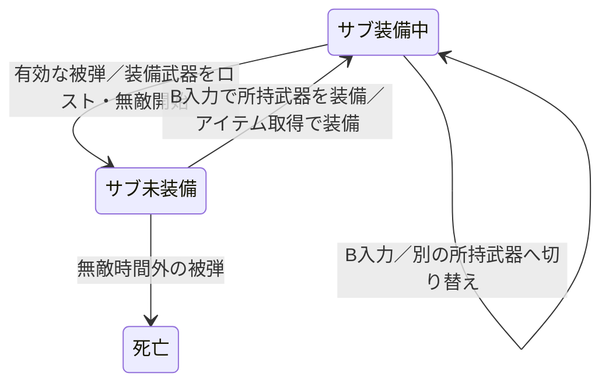

# FamiBasic サンプル縦シューティング 設計書

- 作成日: 2026-09-17
- 版: 0.2（地形への統合、直線レーザー、敵編隊を反映）
- 対象: 既存サンプルゲームの1面構成の縦スクロールシューティング

**固定のメインショットに、収集・強化・切り替えができる4種類のサブ武器を組み合わせる。装備中のサブ武器は被弾で失われ、手動で別の武器を装備して立て直す。ファミコン上の制約の多いBASICで、60fpsを維持できる範囲に仕上げる。**

この文書はゲームデザインの設計書。v008ではmainの8地域・134設備の地形と収集式サブ武器を統合し、4種類の小型敵・2種類の中型敵を配置する。最新の要望に合わせ、レーザーを直線武器へ変更する。実装・ROM検証の詳細はゲームリポジトリのv008に記録する。以下の暫定項目は、今後のプレイ調整の候補として区別する。

## 1. 目指す体験と対象範囲

対象プレイヤーは、王道のシューティングとして、撃つ・避ける・武器を取る楽しさを味わいたい人。1面の中で武器の特徴を理解でき、繰り返すと使い分けが上達する構成にする。

一番楽しい瞬間は、強化したサブ武器に合う敵の配置を捉えて、メインショットと一緒に気持ちよく撃破できること。被弾した場合も、残った武器を選んで戦い続けられる。

- アレスタやR-Typeのように、見て性格が分かる王道の武器を土台にする。
- アーシオンを完成度の目標、メタルキャンサーをユーザーが評価している参考作品として扱う。これらの全機能や物量を再現するという意味ではない。
- 1面の完成度に集中する。面数や武器種の追加を目標にしない。
- 弾の発射間隔、敵の耐久力、編隊の間隔、命中音、短い撃破表示を合わせて、撃破の手応えを作る。
- 入力応答と60fpsを優先する。武器の本質を保ちながら、同時弾数や表示の規模を実測で決める。

## 2. 採用する中核仕様

| 項目 | 仕様 |
|---|---|
| メインショット | 性能固定。アイテム取得やサブ武器の強化で強くならない |
| サブ武器 | ワイドショット、ミサイル、直線レーザー、リバウンド弾の4種類 |
| 攻撃 | メインショットと装備中のサブ武器を並行して発射する |
| 所持 | 取得した武器を種類ごとに保持する |
| 装備 | 所持武器のうち1種類を選ぶ。任意に切り替えられる |
| 強化 | 同じ武器の1個目でLv1、2個目でLv2。Lv2が最大 |
| 強化の保持 | 武器ごとに管理し、切り替えても維持する |
| 最大強化後の取得 | スコアボーナス。加点量は調整項目 |
| 装備中・無敵時間外の被弾 | 現在装備しているサブ武器を失い、メインショットのみになる |
| ロスト後 | 次の武器へ自動では切り替わらない。手動で再装備する |
| 未装備・無敵時間外の被弾 | 他の武器を所持していても死亡する |

「所持していること」と「装備していること」を区別する。被弾を1回受け止められるのは、現在装備している武器があるときだけ。

## 3. 操作

v008のボタン割り当ては次のとおり。

| 入力 | 動作 |
|---|---|
| 十字キー | 自機移動 |
| Aを押し続ける | メインショットと装備中のサブ武器を、それぞれの間隔で連射 |
| Bを押す | 次の所持武器へ切り替える |

- ショットを撃ちながら切り替えられる。
- 切り替え順は `ワイド → ミサイル → レーザー → リバウンド → ワイド`。
- 未所持の武器を飛ばす。所持が1種類ならその武器を維持し、0種類なら何も装備しない。
- Bは押した瞬間に1回だけ受け付け、押しっぱなしで高速に巡回しない。
- ロスト後は、失った武器の次の位置から所持武器を探す。所持が1種類でも、その武器を再装備できる。
- 切り替えでメインショットの性能・発射を変えない。

## 4. 武器

### 4.1 メインショット

常に使える基本攻撃。サブ未装備でも、小型敵を狙って倒せる性能を確保する。弾数、威力、射程、発射間隔はサブ武器の取得・強化・ロストで変化しない。

v008では4フレームごとに1発、威力1、同時4発を基準とする。初期状態を意図的に弱くしてサブ武器の取得を強制する設計にはしない。

### 4.2 サブ武器の一覧

Lv2では、ワイドの外側弾、ミサイルの範囲と威力、レーザーの威力、リバウンドの小型貫通を強化する。以下をv008へ実装する。

| 武器 | Lv1 | Lv2 | 得意な場面 |
|---|---|---|---|
| ワイドショット | メインの左右へ各1発、斜め前に広がる | 外側の左右弾を追加し、左右各2発にする | 横に広がる小型機の編隊 |
| ミサイル | 左右へ一瞬後退してから加速前進。命中時に小範囲の爆発 | 発射数は維持し、爆発範囲と威力を上げる | 密集した敵、隣接する砲台 |
| 直線レーザー | 自機から画面上端までの細い直線。4フレームごとに威力1、貫通 | 同じ射程で威力2へ強化 | 縦隊、正面に捉えた中型敵、同じ列の地上物 |
| リバウンド弾 | 左右斜め前へ各1発。画面の左右端で反射 | 小型敵を貫通できるようにする | 反射後の射線にいる奥の敵 |

### 4.3 ワイドショット

左右へ広がる弾と、正面の固定メインショットで攻撃範囲を作る。弾は決まった横・縦の移動量で直進する。

- 射角を広げすぎず、メインとの間を小型敵が抜けすぎない形にする。
- Lv2は追加された外側の弾によって、見た目と倒せる範囲が変わる。
- 正面に狙いを維持する役割は直線レーザー、左右をまとめて覆う役割はワイドに持たせる。
- 追加弾の処理が60fpsを阻害する場合は、発射間隔・寿命・敵配置と合わせて再設計する。単に弾を増やせると仮定しない。

### 4.4 ミサイル

左右の発射位置から、短時間だけ後ろへ出る。その後、上向きの速度が増して前方へ飛び、敵への命中で周囲を巻き込む。

- 後退時間と加速の変化は固定の数値または短い表で表現する候補。追尾は付けない。
- 後退は発射動作として短くまとめる。取得直後に攻撃が働いていないと感じるほど待たせない。
- 暫定仕様として、爆発の範囲ダメージは命中時に1回だけ与える。
- 直撃した敵も、この1回の範囲ダメージに含める。直撃ダメージとの意図しない二重加算を避ける。
- 爆発の表示は短時間残すが、表示が残っているだけで毎フレーム追加ダメージは与えない。
- 爆発範囲と表示の大きさを対応させ、巻き込める範囲が分かるようにする。
- Lv2は範囲と威力で強化を表現し、斉射数は増やさない。

### 4.5 直線レーザー

自機正面から画面上端まで、細いレーザーを伸ばす。メインショットは通常どおり並行して飛ぶ。

- 横位置を合わせると、遠方の敵にも届く。左右に広がる敵へは移動して狙い直す。
- Lv1・Lv2とも敵を貫通し、4フレームごとに同じ直線上の対象へダメージを与える。威力は1 / 2。
- 大型の地上設備に複数セルがある場合も、1回の攻撃で同じ設備へ重複ダメージを与えない。
- 横に動く中型機へ照準を合わせ続けることと、縦隊を一度に貫くことを楽しさの中心にする。
- 長い射程に合わせて旧近距離版の威力を見直し、ワイドの面制圧とミサイルの爆風が役立つ余地を残す。

### 4.6 リバウンド弾

左右斜め前へ撃った弾が、画面の左右端で横方向を反転して進み続ける。反射位置は可視のプレイ領域の端と一致させる。

- 縦方向は前進を続ける。自機の横位置で反射後の射線が変わる。
- ワイドとの違いは、画面端へ広がった弾が内側に戻り、上方の敵にも届くこと。
- 反射しても弾を分裂させない。上方の画面外へ抜けたら消える。
- Lv1は敵への命中で消える。Lv2では小型敵を貫いて進む案とする。
- 中型敵・ボスは貫通対象に含めない暫定案とする。
- 貫通時の同一敵への連続接触をどう扱うかは実装前に決め、追加管理も含めて処理負荷を測る。

## 5. 取得・所持・強化

### 5.1 取得時の状態変化

同じ種類のアイテムに対する処理は、その武器が装備中かどうかにかかわらず同じ。

| 取得前の状態 | 取得後 |
|---|---|
| 未所持 | Lv1として所持 |
| Lv1 | Lv2へ強化 |
| Lv2 | Lv2のままスコアボーナス |
| ロスト済み | 未所持と同じ。Lv1から取得し直す |

武器を所持する枠は種類ごとに固定し、同じ武器を2枠占有する形にはしない。強化段階は被弾を耐えられる回数には加算しない。

### 5.2 取得と装備の関係

- アイテムを取得したら、毎回その種類へ自動で装備を切り替える。
- 新しい種類の取得、重複によるLv2強化、最大強化後の得点化、ロスト後の再取得のすべてで同じ扱いとする。
- 強化した場合、以後に発射する攻撃へLv2の性能を適用する。
- ロスト後も、新しいアイテムを回収すればその武器を装備できる。被弾した瞬間には他の所持武器へ自動切り替えせず、所持品からの再装備はBで行う。
- B入力と取得が同じフレームなら、取得した武器の装備を優先する。取得でも切り替えでも無敵時間を延長しない。

### 5.3 切り替え中の攻撃（暫定仕様）

- 切り替え後に新たに発射するサブ攻撃は、新しい武器のものにする。
- 発射済みの弾・ミサイル・爆発は、発射時の種類と強さを保って寿命まで処理する。
- 自機に付く直線レーザーは、切り替えまたはロストで停止する。
- サブ弾は全種類で共通の同時出現上限を設ける。切り替えで上限を迂回して弾を積み増せないようにする。
- 切り替え操作で発射待ち時間を短縮しない。具体的な待ち時間の引き継ぎ方は実装で確定する。

## 6. 被弾・ロスト・死亡

### 6.1 基本の状態遷移

| 被弾前 | 有効な被弾を受けた結果 |
|---|---|
| サブ装備中 | 装備中の武器を所持から削除し、未装備になる。ロスト後の無敵時間を開始 |
| ロスト後の無敵中 | 追加の被弾を受理しない |
| 未装備・無敵終了後 | 死亡。他の武器の所持数は救済条件にならない |
| 別の武器を手動で再装備済み・無敵終了後 | 新たに装備した武器を失い、再び未装備になる |

無敵は装備状態と別のタイマーとして扱う。未装備から装備に戻しても、無敵の残り時間は引き継ぎ、切り替え自体では開始・延長しない。

### 6.2 ロストの単位

Lv2で被弾してもLv1には戻さず、その種類の武器を丸ごと失う。他の武器の所持・強化段階は維持する。

ロストした武器は、その場に回収アイテムとしては出さない。後の配置アイテムから再取得できる。

### 6.3 立て直しの時間と表示

- ロスト時に専用の音と自機の点滅で知らせ、装備表示を未装備に変える。
- 気づいてBを押せるだけの無敵時間を設ける。長さは初見プレイで決める。
- 同じフレームに複数の敵弾が重なっても、1回のロストから即死亡へ進まない。
- 残り武器がない場合も、ロストによる無敵時間は与える。その後はメインショットで戦いながら次のアイテムを目指す。
- 装備し直す操作は、短い案内と実際の音・点滅・所持表示で理解できるようにする。

3機制で、死亡時は中央下部へ復帰して120フレーム無敵。残っていた所持武器は維持する。武器ロスト時は90フレーム無敵。ゲームオーバー・クリア後はAを離して押し直すと、装備と地形を初期化して再開始する。

## 7. 画面と音

武器表示は4種類を固定位置に置き、次の3つが分かるようにする。

| 表示 | プレイヤーに伝える状態 |
|---|---|
| 未所持は暗い輪郭、所持は明るいカプセル | 今、選べる武器。回収アイテムと同じW/M/L/Rの意匠を使う |
| レベル数字と2段階の目盛り | 同じ武器を2個集めたこと |
| 白い囲み枠と矢印 | 今撃っている武器、次の被弾で失う武器 |

- 4種類を固定位置のスロットに置き、所持と選択の違いを明るさだけに頼らず枠の有無でも伝える。
- 未装備では選択枠を消す。所持武器があるなら`B:EQUIP`で再装備を案内し、何も所持していない場合は`NO SUB`とする。
- 取得、強化、ロストで音を区別する。強化時には攻撃の変化も見せる。
- メイン弾・サブ弾・敵弾を見分けられる形と配置を優先する。
- 爆発やレーザーで敵弾と自機が隠れないよう、表示サイズ・寿命・重なりを調整する。
- 武器表示の書き換えは取得・切り替え・ロストなどの変化時を中心にする候補。表示の実装方法は既存環境に合わせる。

## 8. 1面の組み立て方（配置案）

2分間のステージで、次の順序を基準に武器を取った結果が分かる場面を作る。具体的な時刻は後述する。

| 区間 | 体験と配置の狙い |
|---|---|
| 導入 | 固定メインで小型編隊を撃破でき、基本操作を理解できる |
| 最初の取得と強化 | ワイドの後に別の武器を体験し、最も癖のある武器の初登場より前にワイドの2個目を置く |
| 別の武器の取得 | ミサイルと密集した護衛、レーザーと縦隊など、取得直後に特徴を試せる |
| 射線の使い分け | リバウンドの反射後の射線に敵を置き、横位置による違いを見せる |
| 後半 | 好きな武器で進めつつ、切り替えれば効率よく倒せる編隊と中型敵を組み合わせる |

- アイテムの種類と出現位置は固定配置を初期案とし、次のプレイで狙えるようにする。
- 冒頭のワイド2連続は採用しない。順序は `ワイド → ミサイル → ワイド → リバウンド → 直線レーザー` を維持する。ワイドの2個目を他の2種類より先に体験できる。
- 好きな武器を使い続けても進める。特定武器の所持だけを必須条件にする敵は置かない。
- アイテムは火力と被弾後の予備装備を兼ねるため、出現数を実質的な耐久回数としても確認する。
- ロスト後も固定メインで小型敵やアイテムを出す敵を倒せるようにする。
- 中型機には停止と移動を設け、レーザーの照準を合わせる時間と、別の敵へ向き直る時間を作る。

### v008の配置と中型敵

- 補給機は2秒後、その後8秒ごと。3秒に横編隊、11秒に密集護衛、19秒に横編隊、27秒に左右侵入、35秒に縦隊を配置する。
- mainの縦列・横列・貨物群を含む134設備を使う。51秒付近の横編隊、82〜85秒の密集護衛を地形の見せ場に合わせる。
- 既存中型はHP32で、停止中に間隔を空けて3方向弾を撃つ。
- 新しい中型装甲艇はHP44。進入・停止・横移動・停止・離脱を行い、3発の短い自機狙い連射と休止を繰り返す。
- 小型5機、中型1機を同時出現の上限とし、中型2種は同じ枠を使う。武器専用の無効化やダメージ倍率は付けない。
- 編隊の形、密度、停止時間、進入方向で武器の得意不得意を作る。後半は同じ組合せを場所を変えて使う。

### 補給機とアイテム

- 決まった時刻・位置に補給機が現れ、倒すと武器アイテムを1個落とす。
- 補給機は、中央のカプセルを左右のクランプ付き推進器で挟んで運ぶ形。運搬中から種類を示し、撃破すると同じカプセルが残る。
- アイテムは面取りした金属ケースとして描き、上面の光・側面の陰・留め具で厚みを示す。中央のW/M/L/Rを判読できる大きさを優先する。
- 補給機はメインショットで楽に倒せる耐久力にし、武器ロスト後の再取得にも使えるようにする。
- アイテムはゆっくり下降する。撃っても消滅せず、種類も変化しない。
- 種類は固定順とし、後半にも強化・再取得の機会を用意する。
- 補給機1機・アイテム1個を同時出現の上限とする基本案。出現間隔は回収に十分な時間を取って調整する。

## 9. BASICで60fpsを目指す実装条件

60fpsは設計上の必須目標。実行環境と最も重い場面を測定するまで、達成可能とは断定しない。ホスト側の表示更新が60fpsでも、ゲーム処理が毎フレーム進んでいる証拠にはならない。

### 9.1 実装前に調べるもの

- 対象サンプルのファイルと版、BASICの実行方式、フレーム待ち・入力・描画命令。
- 現状の通常場面とボス場面の処理時間、フレームの進み方。
- 描画に使える領域、スプライト・背景の使い分け、表示が重なったときの制限。
- 主弾、敵、敵弾、エフェクトの既存上限と当たり判定の走査方法。
- 4武器の所持状態に加え、弾の状態・座標・速度・寿命を管理できる配列とメモリの余力。

### 9.2 処理量を管理する方針

| 対象 | 方針 |
|---|---|
| 全サブ武器 | 固定長の管理枠と共通の同時出現上限を候補にする。切り替え直後も総数を制限する |
| メインショット | サブによる枠の消費でメインが撃てなくならないよう、発射枠を確保する |
| ワイド・リバウンド | 固定の移動量を使う。リバウンドは端の判定と横方向の反転を加える |
| ミサイル | 後退・加速・爆発の少数の状態で管理する。飛行から爆発への移行で管理枠を再利用する候補 |
| 爆発判定 | 命中時に1回だけ周囲の敵を調べる。爆発表示の継続中に繰り返さない |
| レーザー | 細い直線の範囲判定と4フレーム間隔のダメージ。表示には最大13スプライトを使い、発射中の爆発表示は6スプライトへ抑える |
| 描画・音 | 小さなパターンと短い寿命で手応えを作る。追加した絵や音の命令負荷も測る |

弾の管理件数と、描画に必要なスプライト数は別に数える。判定を1つにまとめても、表示負荷まで1つになるとは限らない。

フレーム予算、同時出現上限、武器ごとの描画量は、既存実装を測ってから数値化する。ソース未確認の段階で上限値を保証しない。

### 9.3 負荷確認で重ねる条件

- メイン連射とLv2サブ、敵と敵弾の多い配置、スクロール、音の再生。
- ミサイルの同時着弾と、複数敵の撃破・アイテム出現。
- 発射済みサブが残っている間の武器切り替え。
- 中型機・縦隊・複数の地上設備と直線レーザー、または貫通弾による複数の命中判定。
- ロストの表示・無敵処理・武器切り替えが同時に起こる場面。

平均値に加えて重いフレームを確認し、ゲーム更新の脱落・入力の遅れ・描画の乱れを分けて記録する。達成環境がエミュレータのみなら、その範囲を明記する。

## 10. 検証項目

### 10.1 ルールの確認

| 操作・条件 | 期待する結果 |
|---|---|
| 各武器を1個、2個、3個と取得 | Lv1、Lv2、最大維持と得点加算になる |
| 未装備の所持武器を重複取得 | その武器が強化され、その武器へ装備が切り替わる |
| 最大強化済みの別武器を取得 | 得点を加算し、取得した武器へ装備が切り替わる |
| Bと取得が同じフレーム | 取得した武器が装備される |
| 武器を切り替えて戻す | それぞれの強化段階が維持される |
| Bを押しっぱなし | 押した瞬間の1回だけ切り替わる |
| 装備武器ありで被弾 | その武器だけ失い、未装備と無敵になる |
| Lv2装備中に被弾 | 暫定仕様どおり、その種類を丸ごと失う |
| 他の武器を所持したまま、未装備・無敵終了後に被弾 | 自動救済されず死亡する |
| ロスト後にBで別の武器を装備 | 再び1回の被弾を武器ロストで受け止められる |
| 無敵中に複数回接触 | 追加ロストも死亡も発生しない |
| 無敵中に切り替え | 無敵時間が延長されない |
| ロストした武器を再取得 | Lv1から再取得し、自動装備する |
| 連続して切り替えながら射撃 | 共通の弾上限と発射間隔を迂回しない |
| ミサイルが密集した敵に命中 | 爆発の対象それぞれへ1回ずつダメージを与える |
| ミサイルが単独の敵に命中 | 直撃と爆発を意図せず二重加算しない |
| リバウンドが左右端へ到達 | 見える境界で反射し、上方へ進み続ける |

### 10.2 遊んで判定するもの

- 初見で、メインが固定でサブが変わることを理解できるか。
- 1回目の取得と2回目の強化に、見た目・攻撃範囲・倒す速さの変化を感じるか。
- 4種類それぞれを使いたい場面があり、1種類だけが常に有利になっていないか。
- 被弾後にロストへ気づき、無敵中に手動で装備し直せるか。
- 切り替えを忘れた死亡でも、何が起きたか理解できるか。
- 直線レーザーで縦隊を貫く気持ちよさがあり、横への狙い直しが使い分けにつながるか。
- ワイドとリバウンドで、有効な自機位置や倒せる敵に違いがあるか。
- ロスト後のメインのみでも、再取得へ向かう短い区間が苦痛にならないか。
- 最も重い場面でも、60fpsの進行と入力応答を保てるか。

## 11. 実装の基準と次の確認

| 項目 | 現在の実装と次の確認 |
|---|---|
| 実装対象 | ゲームリポジトリのFLIGHT LAB v008。mainのv007地形を使う専用ビルダー |
| 数値 | 弾速・威力・発射間隔・無敵時間を実装し、今後の人によるプレイで再調整 |
| Lv2の負荷 | Mesen上の前寄り・後ろ寄りの2分通し試験で、更新欠落0を確認 |
| 貫通の命中管理 | 小型は命中時に除去。大型地上物は同じ攻撃からの重複命中を防止 |
| 同フレームの順序 | B切替→取得時の自動装備→被弾の順。切替・取得による無敵延長なし |
| 復帰 | 残機3・地形と装備の初期化・最初のW補給まで再開始試験で確認 |
| 敵とアイテム | 2分、4小型種・2中型種、2秒後から8秒間隔の補給。難易度は人のプレイで確認 |
| 表示 | W/M/L/Rの固定枠、数字と目盛り、白枠と矢印、B:EQUIPを実装。初見での理解を確認 |

以後もこの設計と実測結果を基準に調整する。v008では [ゲーム設計反復ルール](../memory/game_design_rules.md) に沿った実装前3回の設計サイクル、ユーザー原文、自己評価をゲームリポジトリ内に保存した。物理ファミコンと人による初見プレイは未検証。

## 付録: 設計の根拠になったユーザー発言

以下は会話の原文。表記・誤字を含めて保持する。初版のレーザーは近距離・高威力として整理したが、最新の指示により本文を直線レーザーへ変更した。「ロスとして」は「ロストして」の意味で整理した。

### 地形統合・敵・レーザーの更新

> メインの地形がちゃんと入っている奴に、武器を統合して。
> そのあとで、武器を生かせる敵の処理を追加して。メモリに余裕があるなら敵の種類を増やしてくれてもいいし、新たな中型敵もいてもいいと思う。武器によって得意不得意がある感じがいいな。レーザーは近距離武器じゃなくて直線武器にしてほしい

### 目的

> 既存サンプルゲームの改善。縦シューとして、現代の例話に新しく作るゲームとして楽しく遊べるようなクオリティの高いゲームにしたい。パワーアップしシステムをしんぷるでたのしいものにしたいので、アイデアを出して。いちめんしかないのでばりえーしょんはいらないが、アレスタみたいな楽しさや、R-Typeを初めて見た時のような驚きが欲しい。

### 武器の方向性

> あまり変化球にはしたくない。それでいうと、R-Typeくらいか、トレジャーのゲームにありそうなネタか。アイデアを出してみて。

> 普通にアレスタとかR-Type的なそこまでひねらない武器ネタを考えてほしい。イメージとしては、あーしおんみたいな完成度を目指したい。メタルキャンサーはよくできてるので、やるとしてもそんな感じで。そこまで奇はてらわないイメージ。

### 実行環境

> ファミコンで、しかも制約の多いBASICで60fpsを出そうとしているのを忘れないで！

### 固定メインとサブ武器

> メインショットは強くならず、メインショットに並行して出るサブ武器の形を押したい。一つは、メインショットの両側に広がるワイドショット。別の武器として、両側に一瞬後ろに出てから加速しながら前に飛ぶミサイルで、敵に当たると周囲を巻き込んで爆発。もう一つは、目の前のみだが弔意力のレーザー。あともう一つくらいほしい。どう？

### 所持・切り替え・強化

リバウンド弾を4つ目として提案した後の発言。

> いいね。パワーアップシステムはどうしよう？アイテムを取ったら、保持して持ってる奴は任意で切り替えられるのがいいかな？同じの二個とったらさらにぱわーあっぷとかもしたいな。どう思う？

### 採用と被弾ルール

4種類・各2段階、所持武器の順送り切り替え、最大強化後の得点化を提案した後の発言。

> ではそれで。被弾はアイテムロスト、ロスとして切り替えずに被弾したら死亡にしようか。

### 文書化の依頼

> 設計書を作って。

### 実装開始後のアイテム出現順の指定

> 最初にワイド→ワイドだけは却下で。一番癖があるやつより先にワイドの二個目が出る感じで。あとはその基本案で実装を進めて。

### プレイ後の取得・表示の変更

> アイテムを取った時には装備をそのアイテムに切り替えて。アイテムキャリアの絵がアイテムキャリアっぽくないのでいまいち。アレスタだったかな？アイテムを挟んでて来るのがいい気がする。アイテムの画像もいまいちなので、もっと実態間のあるものにしてほしい。画面下の装備ランも、どのアイテムを持っていてどのアイテムを装備中なのかがわかりやすくしてほしい
