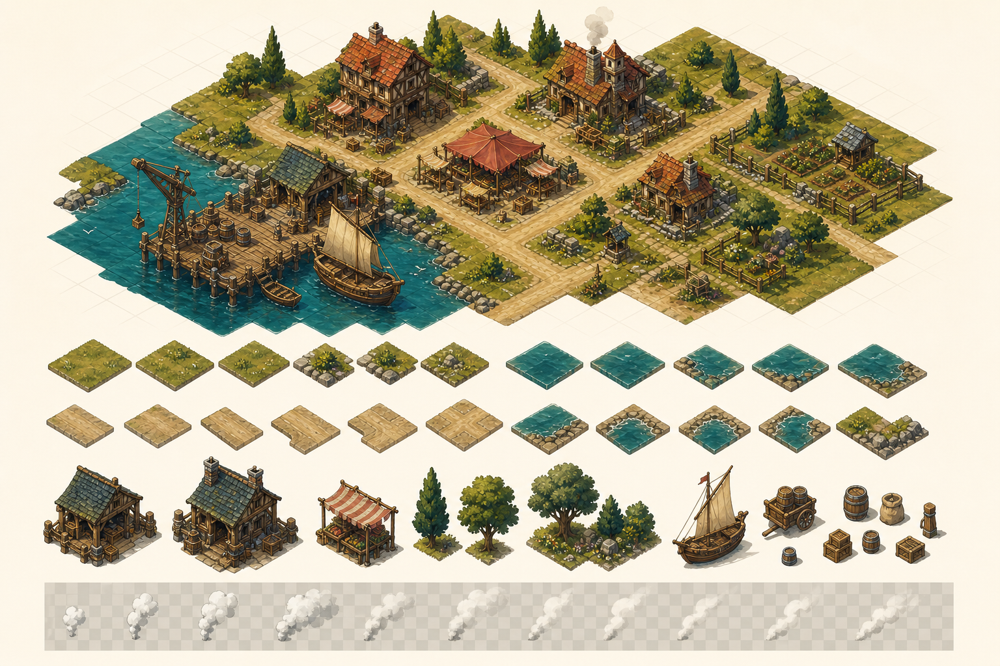
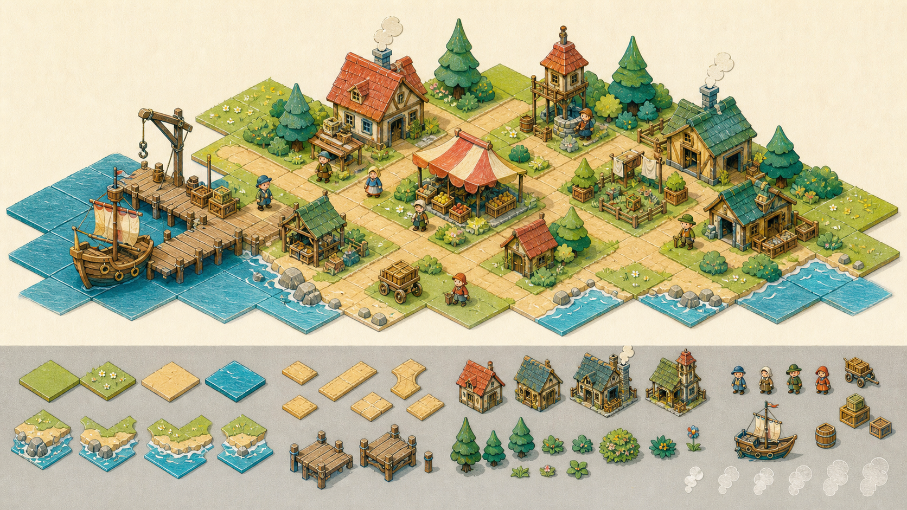
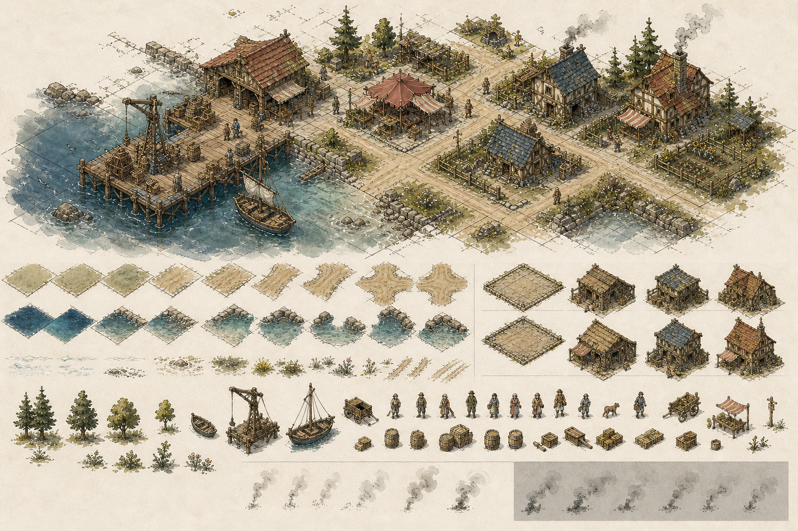
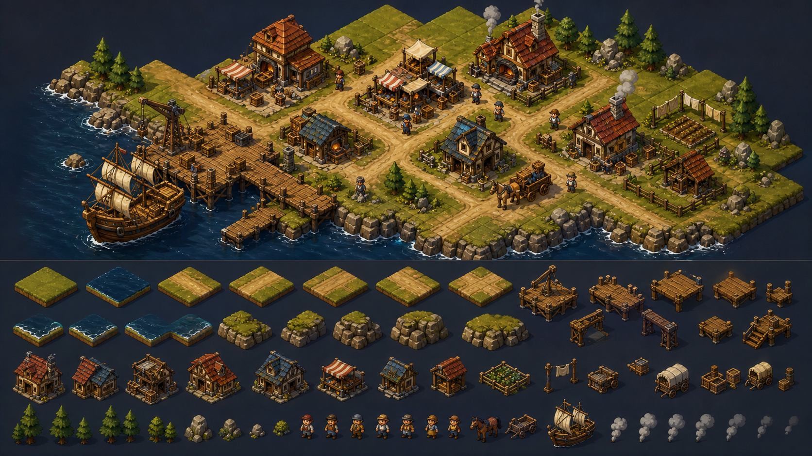
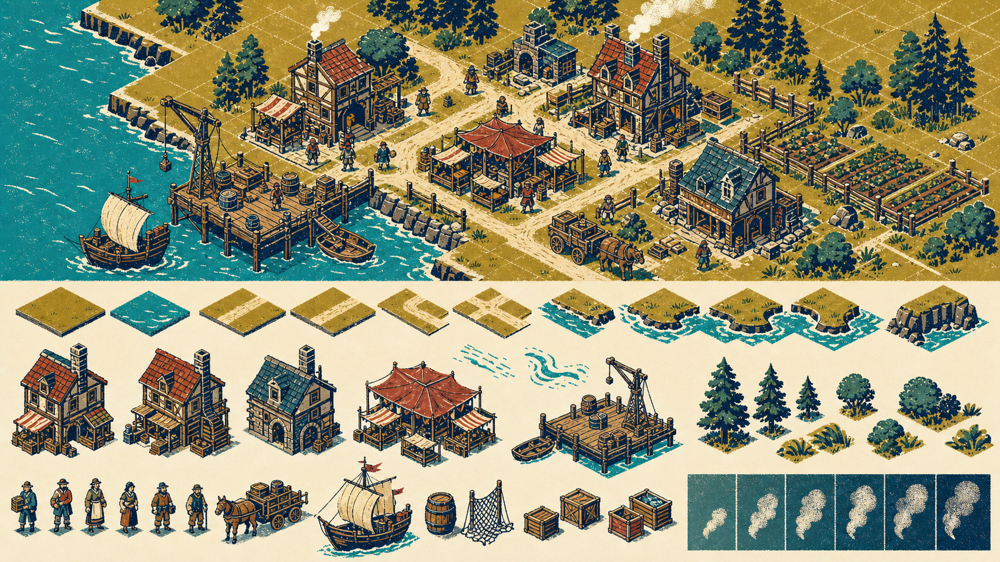

# パーツ分割を前提にしたアート方向性 5案

## 訂正

先に提出した母港の一枚絵は、色・光・密度を見るための**雰囲気見本**であり、量産可能なパーツ設計の証明ではない。道、凹凸海岸、半透明の煙を後から切り出せる絵ではなく、通常盤面へそのまま採用しない。

今回の5案は、上段を「同じパーツを組んだ完成イメージ」、下段を「実際に必要になる部品族」とした方向性比較である。これは量産用完成アセットではなく、人が方向を選ぶための設計画である。

## 共通する分割規則

- 地形はひし形1枚の反復ではなく、2×2〜4×4のマクロタイルを基本にし、継ぎ目を草・石・轍で隠す。
- 道は終端、直線、曲線、T字、十字、広場への接続を同一幅・同一ピボットで用意する。土道と石畳は同じ接続規格にする。
- 海岸は直線、外角、内角、細い水路、砂浜／岩場の差分を持つ。特に内角を最初から描き、凸角の反転で代用しない。
- 建物は固定アイソメ角、左上光、接地ピボットを統一し、建屋、屋根差分、煙突、看板、庭小物を別レイヤーにする。
- 煙はCanvasの楕円ではなく、透明RGBAの4〜6フレームatlasにする。各フレームは同じ原点と余白を持ち、煙突からの合成位置だけをコードで決める。
- 波打ち際は海岸形状のalphaマスクと泡の差分を分ける。泡を地形本体へ焼き込まず、弱・中・強の短いループを海岸縁へ重ねる。

## 5案

### A — ガッシュ調マクロタイル

最も先の一枚絵に近い。筆触を残しつつ、道路接続、海岸の凹凸角、建物、荷物、樹木、煙フレームを中サイズの部品として作る。見栄えは強いが、色境界と筆触の継ぎ目管理は5案中もっとも重い。

### B — 絵本の切り紙＋色鉛筆

面を紙片のように分離し、輪郭と影を短く揃える。道路・海岸の接続が読みやすく、建物差分も屋根と小物で増やせる。煙は半透明の紙片を重ねる短いatlasとして扱える。量産性と温かさのバランスがよい。

### C — インク線＋淡い水彩

形の規格をインク線が担い、水彩のにじみを面の中へ閉じ込める。海岸の内角や道の分岐を最も識別しやすい。線の接続誤差が目立つため、ピボットと線幅の厳密なテンプレートが必要。

### D — 手作りミニチュア・ジオラマ

厚みのある地形ブロック、模型建物、綿状の煙で構成する。部品であることが見た目にも自然で、道や海岸角の組み替えに強い。一方、既存の平面Canvas UIとの距離が大きく、影と高さの当たり判定を厳密に管理する必要がある。

### E — 民芸版画／スクリーンプリント

少色・太い形・版ずれを意匠にする。透明煙は段階的な網点、波は独立した白い版として重ねられる。パーツ境界を様式として許容でき、縮小時の判読性と量産性が最も高い。ただし、先のペイント調より硬く記号的になる。

## 人が決めること

現時点では案を選ばず、通常ゲームへ組み込まない。Nao_uが1案、または「Aの色＋Bの部品構造」のような組合せを選んだ後に、同一の小さな港区画について実PNG atlasを作り、次の合否を取る。

1. 道の全接続を並べても継ぎ目が破綻しない。
2. 海岸の外角・内角・細水路を同じ部品族で組める。
3. 煙と泡が透明背景で静止画・動作時とも縁汚れを出さない。
4. 連続ズーム、選択、ヒットテストを維持する。

## 生成条件

Codex内蔵imagegenを使用し、既存の母港絵は色調の参照にだけ使った。全案に「完成場面と、その場面を構成する部品族を同じシート内へ併記」「固定アイソメ」「道路6接続」「海岸の凸角・凹角」「建物と小物」「透明煙の連番」を共通指定し、画風だけをガッシュ、切り紙、インク水彩、ミニチュア、民芸版画へ変えた。
