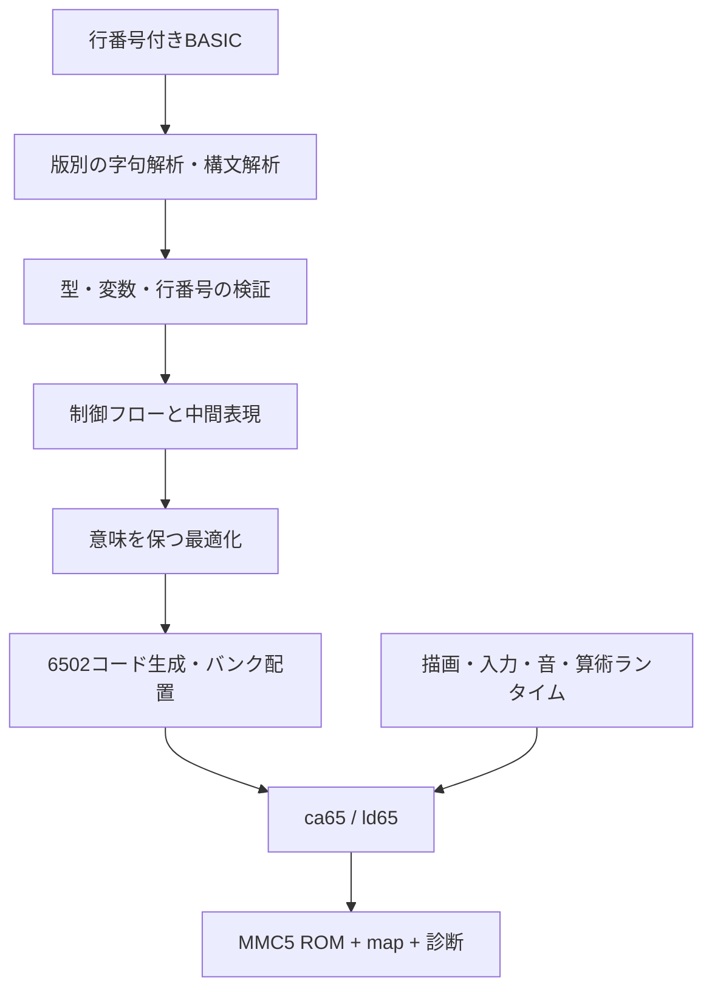

# MMC5 BASIC コンパイラ 基本設計

作成日: 2026-09-16 / 同日改訂: V3ベースのゲーム制作環境へ / 状態: 設計案、未実装・未実測

キャラ／BGエディタと描画APIの具体仕様、更新後の実装順序は[ゲーム制作拡張・エディタ設計](game_extensions_20260916.md)を参照する。

## 1. 提案の要点

**ファミリーベーシックV3を土台にしたBASICを6502機械語へ変換し、MMC5カートリッジ上で独立実行する。** 完全互換よりゲーム制作の実用性を優先し、キャラ／BGエディタ、OAM配列、VBlank転送、スクロール、ラスタースクロールを製品の中核に置く。

本体でRUNしてすぐ始まることを優先要件とする。PC上のクロスコンパイラを開発・検証に使う場合も、本体のコンパイル時間を初期から計測する。同じ言語仕様とランタイムABI（機械語からランタイムを呼ぶ取り決め）を使い、本体版は単純なコード生成を優先する。[8bit整数とRUN応答の決定](integer_types_20260916.md)を参照。

「べーしっ君のように」は、BASICの書きやすさを保って機械語でゲームを動かす体験として採用する。実機上の部分コンパイル、インタプリタとの往復まで初版の必須にはしない。原型のべーしっ君には全体コンパイルと部分コンパイルがあり、両者の変数共有や対応命令には制約がある。[資料1](https://konamiman.github.io/MSX2-Technical-Handbook/md/KunBASIC.html)

### 初期の設計判断

| 項目 | 提案 | 理由 |
|---|---|---|
| 言語の土台 | V3＋ゲーム向け拡張を標準 | 完全互換・V2対応・元ROMのバグ再現は必須にしない |
| 入力 | UTF-8の行番号付きBASICテキスト | PCで編集・差分管理・診断しやすい |
| 出力 | Mapper 5のNES 2.0 ROM、asm、map、行番号対応表 | 配布とデバッグの両方に使う |
| CPU | Ricoh 2A03向けの公式6502命令 | 65C02拡張や非公式命令には依存しない |
| コンパイラ | Pythonで字句解析・構文解析・意味解析・コード生成 | 互換性の探索と小さな比較試験を早く回す |
| アセンブル | ca65 / ld65 | 独立した6502アセンブラとリンカを利用 |
| 実行形式 | ネイティブ機械語＋ランタイム呼出し | 実行時の構文解析と変数名検索をなくす |
| 基本数値 | 未宣言は16bit整数、BYTE/SBYTEを追加 | 8bit同士は8bit、必要な演算の前でI16拡張（案1） |
| 初期ハード | NTSC、PRG-ROM 256 KiB、CHR-ROM 32 KiB、PRG-RAM 32 KiB | 具体的なメモリ予算を持って始める |
| MMC5拡張 | バンク切替・乗算器・走査線IRQ | 描画拡張とエディタを互換機能の網羅より先に作る |

ca65はCコンパイラを経由せず単体で利用できる。BASICをCへ変換する方式は採らず、BASIC固有の制御フローとエラー位置を保持したまま機械語へ下ろす。[資料2](https://cc65.github.io/doc/ca65.html)

## 2. 利用体験と成果物

提案するコマンド名は仮に `famic` とする。以下は使用イメージであり、まだ実行できない。

```text
famic build game.bas --dialect v3-game --target mmc5-32k -o game.nes
famic check game.bas --dialect v3-game
famic report game.bas
```

```basic
10 S=0
20 FOR I=1 TO 100
30 S=S+I
40 NEXT I
50 PRINT S
60 END
```

このようなプログラムでは、`S` と `I` の保存先をコンパイル時に確定する。各反復で行を解読せず、機械語の加算・比較・分岐を実行する。

出力にはROMだけでなく、使用ROM/RAM量、バンク配置、未対応命令、互換上の注意、BASIC行番号と生成アドレスの対応を含める。実行時エラーも元のBASIC行番号を表示する。

PCからROMを生成する類例として、作者公開のMSXBAS2ROMを調査対象にできる。ただしZ80向けの実装をそのまま移植するのではなく、開発体験と試験構成を参考にする。[資料3](https://github.com/amaurycarvalho/msxbas2rom)

## 3. V3ベースで維持するもの

### 3.1 互換性を五つに分ける

| 層 | 目標 | 初期の境界 |
|---|---|---|
| ソース | 既存の行番号付きリストをできるだけそのまま読める | トークン化済みデータ・テープは後段の入力アダプタ |
| 計算 | 数値・文字列・制御フローの通常動作を引き継ぐ | 不合理なバグを再現せず差分を公開 |
| ゲームAPI | 座標、入力値、スプライト状態、音楽の意味が一致 | 対応は命令単位で公開 |
| 時間 | 自動移動や音楽をフレーム基準で進める | 空ループによる待ち時間は高速化で変わる |
| 内部実装 | 旧ROM内部や変数配置への依存を分類 | 旧ROMアドレスへの機械語呼出しは初版対象外 |

**ソースがコンパイルできることと、元のゲームが同じ速さで遊べることは別の合格条件。** 高速化で壊れる空ループ待ちは報告するが、勝手にフレーム待ちへ置換しない。意図を判定できないためである。

### 3.2 言語プロファイル

- `v3-game`: 標準。V3の基本文法と16bit整数を土台に、ゲーム向け命令、BYTE配列、長い変数名、エディタ資源参照を利用できる。
- `fb-v3`の厳密互換モードや`fb-v2`は初期の実装対象に含めない。旧案の`extended`との二分も廃止する。
- 非互換点は命令台帳に記載し、既存リストの修正量で実用性を評価する。未対応命令は診断する。

元のユーザーメモリ容量は再現しない。長い変数名は全文一致とし、旧BASICの2文字同一視に依存したプログラムには移植時の診断を出す。空白省略・短縮記法と長い名前の曖昧さはV3のリスト取込みで解消し、新規コードでは拡張命令と識別子の間に空白を必要とする。

### 3.3 最初に確定する仕様

ファミリーベーシックは16bit整数を使用する。V3の解析では文字列変数が31文字分の固定領域を持ち、短縮キーワードや独自トークン表も確認されている。一般的なMicrosoft BASICの規則を流用せず、字句・数値・文字コードを個別に合わせる。[数値の一次解析](https://github.com/micahcowan/fbdasm/blob/main/BUGS.md)、[内部形式の一次解析](https://github.com/micahcowan/fbdasm/blob/main/DETAILS.md)

| 調査項目 | コンパイラ側の扱い |
|---|---|
| 変数名の有効文字・長さ・同一視 | シンボル化前に版別の規則で正規化する |
| 空白省略、`?`、ピリオド短縮 | 版別キーワード表を使い、文字列・コメントを壊さない |
| 十六進記法、負数、最小値 | MSXの `&H` を無条件に受け入れない。字句と単項マイナスを分離する |
| 演算順位、評価順、真値 | `AND/OR/NOT` をホスト言語のboolや短絡評価に置き換えない |
| オーバーフロー、負数除算、剰余、ゼロ除算 | Pythonの算術を直接使わず、対象機の関数として定義する |
| FORの終値・STEP評価時点、初回判定、NEXT後の値 | 隠れたループ状態も含めて一致させる |
| IFとコロン、ELSEの有無・範囲 | 対象版の文法を確認して解析する |
| DIM、未DIM参照、再DIM、添字下限 | 静的に確保できても実行時の宣言状態を保持する |
| READ/RESTORE、DATAの型変換 | 行番号からDATA位置への表を別に持つ |
| 文字列長、部分文字列、比較、PRINTの空白 | 対象文字コードのバイト列で扱う |
| RND、入力の返値、タイマ | 状態と副作用を持つ関数として扱う |

公開された一次解析ではV3の減算・乗算に特有のオーバーフロー挙動がある。これを「通常の16bit加減乗算」と同一視できない。[資料4](https://github.com/micahcowan/fbdasm/blob/main/BUGS.md)

INTEGERは範囲検査付き16bit整数とし、版固有のバグを再現しない。BYTE/SBYTEの8bit算術は下位8bitで完結し、代入先から計算幅を変更しない案1を採用する。元ROMとの違いは `compatibility.md` に残す。定数畳込みも型ごとの数値規則を保存する。前表の調査は完全再現の完了ゲートにはしない。

### 3.4 対応順序

以下の名前は実装候補群であり、各版の存在・引数形式・省略形は互換表で確定する。

| 段階 | 対象 |
|---|---|
| 言語の核 | 代入、式、PRINT、REM、END、IF、GOTO、GOSUB/RETURN、FOR/NEXT |
| データ | DIM、整数配列、DATA/READ/RESTORE、文字列変数・主要文字列関数 |
| ゲーム入出力 | CLS、LOCATE、STICK/STRIG、INKEY$、画面参照、色・画面切替 |
| ファミベらしい機能 | DEF SPRITE、SPRITE、MOVE、位置・移動状態参照、PLAYなど |
| 追加互換 | 入力待ち、版固有命令、低水準メモリ操作、外部データ取込み |
| 本体開発環境 | RUN、LIST、NEW、編集、保存・読込み、コンパイル診断 |

MSXなどの別BASICの命令をV3標準命令と混同せず、新しい命令は拡張として定義する。未対応文を黙って無視したり、空の処理へ置換したりしない。

## 4. コンパイラ構成



### 4.1 中間表現

主な操作を `load_i16`、`store_i16`、`add_i16_checked`、`cmp_i16`、`branch`、`gosub`、`array_load`、`runtime_call` として表す。各命令に元の行番号・文位置・副作用・エラー可能性を付ける。

BASICはGOTOで任意の行へ飛べるため、構文上のFORを直ちにC風の構造化ループへ変換しない。まず各行・各文を基本ブロックへ変換し、分岐のグラフを作る。未定義行は診断し、行番号のない内部継続点にも安定したIDを付ける。

### 4.2 変数と配列

- 整数変数には固定オフセットを割り当て、文字列・配列には固定ディスクリプタを持たせる。
- `CLEAR`などが未実装の段階では明示的に拒否する。対応時は値と初期化状態の両方をリセットする。
- 定数DIMは領域を事前予約できる。ただしDIM文の実行順・再定義エラーを消さない。
- 動的DIMは後段で8 KiB単位のbank-aware allocatorに追加。MVPでは定数DIMのみと明示する。
- 配列は最初は単一8 KiBバンク内に配置。大きな配列は後段で論理添字からバンク＋オフセットを計算する。
- 文字列は31文字＋管理情報を基本に、文内の一時文字列用スタックを用意。連結や自己代入で元の値を破壊しない。
- 一時領域不足と配列境界違反は行番号付きエラーとする。

### 4.3 最適化

最初は定数畳込み、不要な一時コピーの削減、即値命令、直接分岐、使用頻度の高い変数のゼロページ配置から始める。

次に、範囲が証明できる計算だけ検査を省略し、一定値の加算・乗算を短縮する。例えば `X*2` のシフト化も、オーバーフロー判定と対象版の結果を保存できる場合に限る。

RND・入力・画面読取り・PEEK・タイマ・エラーを起こす式を勝手に消さない。ループ待ちを自動削除しない。ゼロページへのキャッシュも、外部機械語やメモリ操作が参照する変数には使用しない。

## 5. MMC5の利用とメモリ設計

MMC5のPRG mode 3には独立した8 KiB窓があり、最上位窓はROM専用である。乗算器は符号なし8×8→16bitで、16bit BASICの乗算は複数回の部分積と符号処理を組み合わせる。PRG-RAM容量とバンク番号の対応は基板配線にも依存するため、「MMC5なら同じRAMがある」とは扱わない。[資料5](https://www.nesdev.org/wiki/MMC5)

### 5.1 初期CPUマップ

| アドレス | 容量 | 用途 |
|---|---:|---|
| $0000–$00FF | 256 B | ABI、一時値、ホット変数。NMI用領域を分離 |
| $0100–$01FF | 256 B | CPUスタック。BASICの深いGOSUBを積まない |
| $0200–$02FF | 256 B | OAM DMA用の確定済みスプライトバッファ |
| $0300–$07FF | 1280 B | 入力・表示・NMIの状態、短い転送バッファ等 |
| $6000–$7FFF | 8 KiB | 固定PRG-RAMバンク0。ランタイム状態とバッファ |
| $8000–$9FFF | 8 KiB | 生成コード窓A |
| $A000–$BFFF | 8 KiB | 生成コード窓B。Aと対にして16 KiBコードページ |
| $C000–$DFFF | 8 KiB | PRG-RAMバンク1、またはバンク2/3・ROM資源の一時窓 |
| $E000–$FFFF | 8 KiB | ソフトウェア上固定するカーネル、NMI、遠距離分岐、ベクタ |

PRG-RAMは32 KiBを初期要件とし、固定領域8 KiB＋通常BASICデータ8 KiB＋追加領域16 KiBに分ける。これは元BASICのユーザー領域サイズとは別の本プロジェクトの予算である。

固定8 KiBの仮予算: 画面影2 KiB、VRAM転送キュー2 KiB、スプライト・音楽状態1 KiB、BASIC制御スタック1 KiB、一時領域1 KiB、余裕1 KiB。割当は実装時にmapで検証する。大きなBGMデータは固定領域へ丸ごと載せず、先読みキューにする。

通常BASICデータ8 KiBを直接アクセスの高速領域とする。追加領域利用時は固定カーネルのアクセサが$C000窓を切り替え、処理完了後にバンク1へ戻す。可変窓へのポインタを呼出し後まで保持しない。

### 5.2 バンクをまたぐコード

- 最初の動作版は生成コード16 KiB以内。超過時はサイズと原因を示して停止する。
- 次段階では基本ブロックを16 KiBコードページへ配置。頻繁に往復するループは同じページに寄せる。
- バンクをまたぐGOTOは固定カーネル経由で窓A/Bを切り替えてJMPする。ページ終端の自然な次行移行にも同じ処理を入れる。
- BASICのGOSUBは専用RAMスタックへ「戻りコードページ＋継続アドレス」を保存し、RETURNで復元してJMPする。同一ページだけCPUスタックへ積む混在方式は初期には採らない。
- FORの状態は制御スタックに変数ID・終値・STEP・継続位置を保持する。NEXT時の探索やGOTO退出時の扱いは対象版に合わせる。
- 生のJSR/RTSは固定ランタイム内部か、バンク切替のない局所処理に限定する。
- NMI/IRQは固定ROMと固定RAMだけで完結し、コード窓・データ窓を変更しない。

8 KiBの固定ROMへランタイム全体が収まる保証はない。最初にカーネルのサイズを計測する。大きな文字列・音楽解析などは、専用ゲートが戻りバンクを保存して呼ぶROMモジュールへ分割する。NMIが必要とする処理は移動しない。

### 5.3 乗算器

符号付き16bitの積には絶対値の扱いと最大32bitの中間結果が必要。範囲検査が要る通常経路では上位部分積を省略しない。オペランドが8bit範囲に収まる場合だけ短い経路を使う。

乗算レジスタは主処理専用とし、NMI/IRQは利用しない。主処理の2回の書込みの間に割り込みが来ても、計算途中のオペランドが上書きされない設計にする。

### 5.4 起動とカートリッジ要件

RESET直後は描画・割り込みを止め、PPUの起動待ち、MMC5モードと各窓、RAM書込み保護解除、RAM初期化、CHR、ネームテーブル、音源を設定してからNMIを許可する。ベクタを含む末尾ROMバンクは、リセット時のマッピングとROMサイズの両方で確認する。

NES 2.0ヘッダにMapper 5、ROM/RAMサイズ、地域情報を記録し、実際のレイアウトと照合する。初期は保存用電池を必須とせず、起動時に状態を初期化する。実機評価時には32 KiB RAMの搭載とバンク対応を別途確認する。

CHRはまずROMを使用。文字・画像はビルド時に変換し、実行時はCHRバンクを選ぶ。実行時の自由なタイル書換えを追加する場合は、CHR-RAM基板プロファイルを別に設計する。ExRAMは初期の必須領域に数えない。

## 6. ゲームランタイム

### 6.1 描画とNMI

主処理は画面の影データと命令キューを更新し、NMIは完成済みキューだけをVBlank中に転送する。キューは二重化または書込み完了後の1byte公開インデックスで受け渡す。16bitポインタの書換え途中をNMIに読ませない。

転送量はバイト数だけでなくサイクル数で制限する。OAMの準備とDMA、音、スクロール復元、割り込み出入りも予算に含める。FRAMEでは予算を超える一括更新を公開前に拒否する。VBFLUSHだけが転送を複数フレームへ分割する。未公開キューの満杯は予約時のエラーとし、NMIで消費できないキューを待ち続けるデッドロックを避ける。

`PRINT`直後の画面読取りは原則として論理画面を参照する。ただし元BASICが実画面の反映を待つ命令については、互換試験を基に待機を入れる。CLR・スクロール・表示モード変更の完了条件も命令ごとに定義する。

フレーム公開は `FRAME`、転送の消化は `VBFLUSH` に統一する。前者はOAM・BG転送・スクロール・ラスター設定を同じフレームとして公開する。命令契約と容量超過時の動作は[拡張設計](game_extensions_20260916.md)を正本とし、旧案のVSYNCだけで更新を公開する方式は採用しない。

PPUの同一走査線上のスプライト数制限はMMC5でも残る。スプライト制限解除を有効にしたエミュレータだけで合格にしない。[資料6](https://www.nesdev.org/wiki/PPU_sprite_evaluation)

### 6.2 スプライトと自動移動

DEF SPRITE等をOAMに直結させず、論理スプライト層を置く。パターン、座標、反転、表示状態、アニメーション、移動速度・残距離を管理する。

自動移動は対象版の更新周期を観測して実装する。状態更新の経路を一つにし、主処理からの変更はキュー化する。NMI内の固定時間処理として実装可能か計測し、収まらない場合は状態計算を事前処理へ分割する。読取り命令には一貫したスナップショットを返す。

手動で座標を更新するBASICループは高速化されるが、MOVEに渡した時間・速度はフレーム基準で維持する。これが既存ゲームの遊びやすさを保つ中心になる。

標準キャラクタ番号や文字コードと描画資源の対応表を分離する。初期配布には独自作成のフォント・図形を使い、命令互換と元画像の一致を別に評価する。既存プログラムで画像一致が必要な場合は、ユーザー指定の資源パックをビルド入力にできる構成とする。

### 6.3 音楽と入力

- 定数のPLAY文字列はPC側で音楽イベント列に変換し、毎フレームの再生だけを実機で行う。
- 変数で構築するPLAY文字列は後段でランタイム解析を追加し、それまでは明示的に未対応とする。
- 元のPLAYが待機する条件・並行再生する条件、テンポ、音長を比較する。初版は本体APUを優先し、MMC5追加音源は拡張として導入する。
- コントローラはフレームごとの状態と押下エッジを分けて保存。STICK/STRIGの番号・ビット・継続押下は対象版へ変換する。
- INKEY$/INPUTに必要なキーボード処理とコントローラ読取りは$4016の共通ドライバにまとめる。片方の処理がもう片方の走査を壊さないようにする。
- キーボード走査の待ち時間を省かない。全キー走査はVBlank予算を圧迫するので、NMIから分離した有界サービス処理を検討し、呼出し周期を実測する。[資料7](https://www.nesdev.org/wiki/Family_basic_keyboard)

STOPキー等による中断はループの後方分岐とランタイム呼出しで確認する。無限ループでも中断点を通るようにし、NMIがBASICへ直接再入しない。

## 7. PEEK/POKEと機械語連携

旧BASICのROM内部ルーチン呼出しや変数領域アドレスは、新しいランタイムの配置と一致しない。ここを「全部そのまま動く」とは約束しない。

旧リスト向けのPEEK/POKEを実装する場合は、V3の公開仕様・代表的な使用例に基づく対応アドレス表を通す。未対応の範囲は固定アドレスならビルド時、動的アドレスなら実行時に診断する。CPUアドレス直通を既定にしない。

標準の`v3-game`ではOAMシステム配列・VBWRITE・スクロール命令を低水準APIとして提供する。外部機械語連携は固定ABIの入口とバンク情報付き参照を使う。任意POKEが最適化済み変数やコードを書き換える前提は扱わない。

## 8. 即時起動を優先する本体コンパイラ

本体での入力・RUN・実行を製品要件として設計する。完成したエディタを待たず、トークン列を読み込む小さな本体コンパイラからRUN開始時間を検証する。PC版のPythonコンパイラをそのまま移植する想定ではない。

```text
キーボード入力 → 行エディタ → トークン化ソース
                            ↓
                  6502製の二段階コンパイラ
                            ↓
                    PRG-RAM上の機械語 → 実行
```

共通化するのは言語仕様、テスト、機械語テンプレートの意味、ランタイムABI、再配置情報の形式。本体版はコンパクトな字句・構文処理と直接コード生成を別実装する。

入力時に字句解析と可能な構文チェックを済ませる。編集後のRUNではまず全体コンパイル方式で、変数・行番号・生成サイズを収集してからコードを出力し分岐を解決する。固定テンプレートから始め、8bitの型判定に反復推論を使わない。未編集の再RUNは有効な機械語を再利用し、実行状態だけを初期化する。ソース・型・資源配置等の変更では世代番号を更新し古いコードを失効させる。部分再コンパイルは必要性を計測してから追加する。

32 KiB RAMでは、ランタイム8 KiB＋BASICデータ8 KiB＋ソース6 KiB＋コンパイラ作業2 KiB＋生成コード8 KiBという小規模案が考えられる。これは容量仮説で、到達保証ではない。コンパイラ本体はROMに置き、編集/コンパイル時と実行時で窓配置を切り替える。

64 KiB以上のRAMでソース・生成コードを増やす場合は、対応基板とエミュレータを明示した別ターゲットにする。バッテリRAM保存、テープ入出力、ホストからの転送も別機能であり、MMC5自体に汎用ファイル保存機能があるとは考えない。

部分コンパイルとインタプリタの混在はさらに後。共通変数形式、GOSUB/FORスタック、境界をまたぐGOTO、エラーからの復帰を設計する必要があり、まず全体コンパイルで体験を成立させる。

## 9. 検証と性能評価

### 9.1 三つの比較相手

1. 元のファミリーベーシック: ユーザー所有ROM等の参照環境で短いプログラムを実行し、版・ROMハッシュ・入力列・結果を記録する。今回の設計作業では実行していない。
2. PC上の意味モデル: テスト用の小さな評価器。数値規則や制御フローを確認する。生成器と同じコードを使うだけの自己確認にしない。
3. 生成ROM: 命令トレース・RAM・画面・フレーム数を観測し、意味モデルおよび参照結果と照合する。

最終的には独立した二つのエミュレータと実機で検証する。エミュレータ名だけでMMC5対応を仮定せず、使用版と実際に通したバンク・RAM・音・割り込みの試験を記録する。

### 9.2 必須試験

| 分野 | 合格条件 |
|---|---|
| 算術 | 境界値・正負の組合せ・除算誤差・エラーがプロファイルの期待値に一致 |
| 制御 | ネストしたGOSUB/FOR、IFのコロン、非構造的GOTO、スタック不足を正しく処理 |
| データ | DIMの実行状態、範囲外、文字列自己連結、一時領域不足、READ末尾を検出 |
| バンク | 境界を越えるGOTO/GOSUB/RETURN、資源読取り後の復帰、割込み時の状態保存 |
| 描画 | キュー飽和・全画面更新・OAM更新中の割込みで破損しない |
| 時間 | MOVE・音楽・キー継続押下がBASICループ速度に依存して加速しない |
| 互換 | 選定した既存リストに、未変更実行と変更箇所一覧の両方を残す |

参照資料に書かれた癖は「確認済み実測」と混同せず、出典由来の期待値として保存する。観測結果が異なれば版差・入力方法を調べる。

### 9.3 性能目標

初期目標は**描画・待機を除いた整数ループで元BASIC比10倍以上**。これは達成見込みを検証する仮目標で、現時点の実測値ではない。

加算ループ、乗除算、配列添字、分岐の多い判定、文字列、実際のゲーム更新を別々に測る。コンパイル時間、CPUサイクル、機械語サイズ、RAM、フレーム落ちを同時に記録する。

コンパイルの有無、最適化の有無、MMC5乗算器の有無を比較し、どこが速くなったかを分離する。PRINTやFRAME待ちを含めた総時間だけで「何十倍」と主張しない。本体ではRUN受理から最初のユーザー命令までを編集後・未編集再RUN・初回ロード後で測り、入力応答とRAM使用量も確認する。許容ミリ秒値は実測と体感で決め、現時点で達成を保証しない。

## 10. 実装順序と完了条件

| 段階 | 作るもの | 完了条件 |
|---|---|---|
| 0: 仕様確定 | 命令台帳、数値・字句・FORの比較ケース、ターゲット設定 | 参照結果と未検証点が分離されている |
| 1: 最小コンパイラ | 行番号、代入、整数加減算、IF/GOTO、FOR、PRINT、起動ROM、本体の小規模コード生成 | 加算例が5050を表示し、型別演算を確認。本体の編集後RUN相当・再RUN時間を計測 |
| 2: ゲーム向け縦切り | キャラ／BGエディタ最小版、BYTE配列、OAM、VBlankキュー、FRAME | 自作画像とBGを使いBASICから操作できる |
| 3: スクロール | BGSCROLL、画面端の列更新、ラスターテーブル | 固定HUDと多重スクロール、画面境界更新が成立 |
| 4: 実用化 | 音楽、当たり判定用マップ、メタスプライト、複数コードバンク、最適化 | 1ステージのゲームを作り、時間・容量・操作で評価 |
| 5: 本体開発環境 | エディタ、本体コンパイラ、保存 | 実機で入力→コンパイル→実行→修正が完結 |

最初に着手する実装単位は段階0と1。文法を大量に追加する前に、「BASICテキスト→機械語→MMC5 ROM→画面出力」の一連を通す。その後のデモ制作ではワークスペースのゲーム設計ルールを別途読む。

## 11. 次の実装のファイル構成案

```text
compiler/       字句・構文・型・制御フロー・6502生成
runtime/        起動、算術、画面、入力、音、遠距離分岐
targets/        MMC5メモリ配置、ヘッダ、基板プロファイル
spec/           方言ごとの命令台帳・互換性表
tests/          言語、ROM実行、バンク境界、参照結果
examples/       最小例とゲーム用デモ
assets/         独自フォント・図形・音データ
```

製品名はFamiBASIC Turbo、実装リポジトリは `D:\HomeBrew\FamiBASIC_Turbo` に確定。この基本設計と作業記憶は `GPT/memory/projects/mmc5_basic/` に保持する。キャラエディタの具体仕様はプロジェクト側 `docs/character_editor.md` を参照する。既存MonoSHのコードやメモリ配置をそのまま流用する決定はしていない。

## 12. 設計レビューの結論

この構成の利点は、速くしたい計算を直接機械語にしながら、V3の書きやすさと実用的な描画制御を両立できること。難所はパーサ自体よりも、割込みとの共有状態、バンクをまたぐ戻り、描画の時間、エディタと実行資源の整合である。

最初は短いBASICがROMになり結果と速度を確認できること。次の製品上の成功は、エディタで作った画像とBGを使って、スクロールするゲームをBASICで作れることとする。

### 未確定事項

- 本体のRUN開始時間の許容値と、想定プログラム規模。PCだけの計測で本体要件を満たしたとは判定しない。
- エディタのUI基盤と本体版の保存手段。言語はV3ベース、エディタはPC版先行・本体版も制作で確定。
- 実機で使用するMMC5基板・RAM・ROM書込み手段。
- 画像まで合わせるための資源パックと、入力キーボードの評価環境。

これらは方式選定と実機検証に影響するが、言語の核・比較ケース・機械語生成の設計は独立して進められる。
