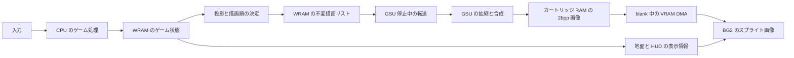

# MonoSH Super FX2 描画フレームワーク設計書

NES版MonoSHを元に、MSXSHのV9968版で使っている60Hzの時間・投影仕様をSNESのCPUへ移植し、Super FX2のGSUに奥から手前への拡縮スプライト描画を任せる。地面はPPUの通常BGで表示する。作成日は2026年10月5日。後述の初期設計に加えて、同日に実行可能な移植版を実装した。

## 現在の実装：ゲーム移植版 v001

[操作・実装の入口](game/v001/README.md)、[実ゲームの検証結果](game/v001/RESULTS.md)、[ROM](releases/MonoSHFX2_v001.sfc) を正本とする。以下の初期設計の未実装記述は、ハードウェアプローブだけを作った時点の記録。

|項目|採用した実装|
|---|---|
|表示|256×180。横は維持、内部192行の画像の上下をcrop。座標・判定は縮めない|
|FB|256×192、2bpp、GSU RAM `$702000`〜`$704fff` の12KiB|
|CPU/GSU|CPUコードはWRAM bank 7F、定数・作業領域は7E。GSU描画中にCPUが次の更新・リストを作る|
|描画リスト|64枠。65816が自機・自弾のOBJを分け、残りを優先順位とZで安定ソート。GSU側がclip・flip・Q8.8 UV計算|
|GSU|STOP中に10byte/体のリストを書き、GOからSTOPまで固定。前回の描画tileを消去してQ8.8拡縮・透過合成。等倍・半分・1/4・2倍など7経路はpacked参照|
|自機・自弾|16×16 OBJ。自機32×48は6枠、17poseと弾16サイズを静的CHRへ事前生成。反射弾を含む通常最大12枠、OAMは毎画像68bytes|
|転送|前回・今回の矩形を8×8タイルへ丸め、各32列に縦の和集合を作る。最大32区間。大きければ全12KiBへfallback|
|地面・遠景|Mode 0。BG2のV固定、BG3の行別H/Vと同一消失点からの直線式、14相の奥行き帯ごとの黄緑四色、紫の空、BG4独立H/V。地上物の接地は原本の距離表を保存。可変表は3組|
|時間|60Hz刻みの元ロジック。間に合わなければ次の枠を待ちゲーム時間も遅くなる。最新のfps・CPU/GSU時間はRESULTS.md|
|ゲーム範囲|元のStage 1、EM0/EM1、自弾・敵弾・反射弾、転倒・死亡・復帰、9節ボス・撃破・次周|

192行の全転送不足に対して矩形転送を導入した。実ゲームのHDMAを加えた最大量テストでは184行表示でも59bytesが欠ける条件があり、180行に下げて全12KiB・全FB画素・guard一致を確認した。地面用HDMAの固定設定は起動時だけにして、黒帯ではポインタだけを切り替える。

更新・投影・当たり判定の主要経路を65816へ移し、C参照版との通常・ボスの状態・有効描画矩形を比較する。地面の色表はビルド時生成し、STOP中に256byteをWRAMへDMAする。最終RGBと地面投影を三つのカメラ位置で独立検査し、OBJは全pose・反転・サイズ・端・点滅も照合する。

OBJ CHRはVRAM C000–FFFF、遠景mapはB000。OAMはFXの描画世代と一緒に固定する。黒帯の最終1行（22行目）はforced blankを解除して輝度0にし、OBJの評価・CHR読み出しを準備する。表示は23〜202行の180行。全12KiB＋OAMの転送、準備行、最終画素は [全転送検査](game/v001/results/full_transfer_objects/summary.json) で確認する。

**192行表示と全場面60fpsは改善目標として残る。** CPU全体にはゲーム処理だけでなく、OBJ・packet・HDMA表の準備費用がある。直線パースで横表の区間も増えたため、地面表の再利用とOBJ準備の高速化、任意倍率のGSU描画が次の課題。過去の35.31fps・55.11fpsの測定は履歴としてRESULTS_INITIAL.md・RESULTS_20261005.mdへ分けた。

## 以下は実装前の初期設計とハードウェアプローブ

**第一目標は横256・縦192へ直接描画し、上下黒帯で2bpp画像全体を毎フレーム転送する構成。** ロジックと描画はともに60Hz。NES版の128×96を縦横2倍にした256×192と同じ画面領域比率4:3を維持する。v001の実行検証では192行の全12KiB転送が992bytes欠け、初期構成の全転送は未成立。描画は最大原画からの縮小のみで動き、木30体の人工場面はクリア込み9.54ms、近距離が増えると11.01ms。CPU処理は本体WRAMへ置いてGSUと並行する設計だが、ゲームロジックの移植と「CPU は4msで終わる」の実測はまだ。

本書のハードウェア挙動は主に公開エミュレータのソースで確認した。そこで確認した挙動を実機の証明とは扱わず、実機または標準設定の複数エミュレータで確認する項目を分けた。時間、メモリ配置、API は提案値であり、完成済みの実装仕様ではない。

## v001で実装・測定した範囲

ユーザーの追加指示により、同日にca65/casfxの検証ROMをMesenで実行した。詳細と生データは [v001の測定結果](probes/v001/RESULTS.md)、再実行は [v001の入口](probes/v001/README.md)。

| 対象 | 確認済み | 未確認 |
| --- | --- | --- |
| GSU | 起動、WRAMからのSTOP待ち、12KiBクリア、11種類の縮小描画、透過合成、flush | RAM描画リストの解析、汎用の入力検査 |
| 画素 | 幅1〜128を含む534件、30体合成2件が参照FBと一致、guard正常 | 非整数倍率での方式間の丸め統一、packed／区間描画の画面外clip |
| 帯域 | 224／192行、HDMAでの黒帯、全画像DMAの不足をVRAMのbyteで確認 | packet用reverse DMA、地面HDMA・OAM/CGRAMを加えた総量 |
| 性能比較 | NESの生成済み木描画本体とFX2の最大の木を個別に計測 | 実ゲームscene、CPUロジック、同時実行、割り込み、実機 |

検証ROMはLuaから入力を受け取るハードウェアプローブ。ゲーム移植、操作できるデモ、実機での60fps達成まで終わった状態ではない。

## 目標と保留事項

| 項目 | 要求または今回の扱い |
| --- | --- |
| 対象 | SNES と Super FX2。高速モードの GSU を約21.48MHzとして予算化 |
| 表示更新 | NTSC の約60.1Hzに同期し、毎回完成した新しい絵を表示する |
| ゲーム更新 | 60Hz。MSXSH の Z2 と倍密度の経路・時間換算を参照する |
| 転送方式 | 初回は上下黒帯を使った全フレームバッファ転送 |
| 描画 | 2bpp の透明フレームバッファへ拡縮スプライトを後方から合成 |
| CPU | ゲーム処理、当たり判定、投影、描画順決定、地面用 HDMA 表作成 |
| GSU | クリア、描画リスト消費、クリッピング、最近傍拡縮、合成 |
| PPU | フレームバッファを BG として表示。通常 BG で地面、遠景、HUD |
| 移植 | 元の状態機械、敵パターン、当たり判定の整数演算を優先して保持 |
| 未決 | 有効画面サイズの最終値、色数、自機の表示方法、実機検証環境 |

「60fps」は表示周期だけでは達成扱いにしない。`logic_tick` と完成画像の `render_id` が毎回進み、動く対象の位置やサイズが毎回更新されていることを検証する。

## NES 版を読んで確認した移植境界

参照元は `D:\HomeBrew\MonoSH`。HEAD は `c0e91a8dc5426afad3b4cd56f16fee2c355321fa`、ブランチは `main`。作業ツリーの `src/game.c` と `tools/coltest/harness.c` に未 commit の変更があり、削除差分もある。以下は現在の作業ツリーを読んだ結果であり、HEAD と完全に一致する保証はない。移植開始時に採用する版を固定する。

- `src/game.c` の約2445行以降では Frame2 に更新処理、約2608行以降では Frame1 にソフトウェア描画を分けている。`frame_counter_30`、タイトルや入力処理のコメントでも30Hzが明示されている。
- `sys/monobitmap_config.h` は有効ビットマップ128×96、横方向に余白を持つ VBUF 幅256。描画と衝突にはこの座標系が混在し、単純に SNES のピクセル座標へ置換すると判定が変わる。
- `src/bgobj.h` は背景物16、敵8、敵弾6の計30スロットと8個の Z bucket を持つ。自弾3、反射弾、ボス部位、演出は別に数える必要がある。
- `src/draw_bgobj_all.s` と C の参照実装は bucket から描画関数を発行している。ここを描画コマンド生成に差し替えると、状態更新側の変更を小さくできる。
- 敵移動、弾、カメラ、ボス、衝突には6502 asm と C 参照実装が存在する。PPU/OAM書き込み、MMC5 banking、farcall、割り込みとゲーム処理が一部結合している。
- ボスは通常の bucket の前に描き、ボス弾を後に合成する例外がある。単一の厳密 Z sort に変えると既存の見え方が変わるので、互換版では明示的な描画グループを保持する。

ユーザーの「NES でロジック8ms」は今回の入力値として扱う。既存ビルドの同一シーンを測定し直していない。`sys/debug_profile.h` に処理区間の計測入口があるため、後で SNES 側の区間と対応させる。

### そのまま使う部分と置き換える部分

| 維持する部分 | SNES へ置き換える部分 |
| --- | --- |
| 敵出現、移動パターン、攻撃、寿命、ボス状態機械 | NES の2フレーム描画スケジューラ |
| ワールド座標、乱数列、衝突条件、更新順序 | VBUF blitter、CHR転送、MMC5 EXRAM、mapper bank 操作 |
| サイズテーブルや投影の参照実装 | 描画関数を GSU コマンド生成へ置換 |
| 仮想的な自機・弾の表示位置 | 直接の OAM 書き込みを表示用スナップショットへ置換 |

ゲーム状態は元のワールド座標と、MSX版の倍密度Z2を保持する。NESのVBUFを経由する部分には `x = 2 * (nes_vbuf_x - 64)` 等の変換が必要だが、対象別の既存biasは個別に照合する。MSX由来の中心X・足元YとNESのVBUF値を同じ単位として混ぜない。画面の高さ変更には全対象共通の投影変換を適用する。最終的な倍率と地平線位置は画面構成が決まってから固定する。

## MSXSH の60Hz実装を参照する移植方針

時間・投影・滑らかな拡縮の直接の参照元は `D:\MSXDev\MSXSH`。HEADは `c4b23c299fa5bcd8a96750f4861de0bd5b9ab1fa`、ブランチは `main`。runtime、敵、背景物、ボス、生成スクリプト等に既存の未commit変更がある。今回は読み取りのみ行い、MSXのROM再計測はしていない。

READMEには30Hzロジックの旧記述が残っているが、現在の作業ツリーのruntimeと更新・生成処理では60Hz化を確認した。移植時はREADMEの旧説明でなく、ユーザーが使用している現行ソースを固定して参照する。

| 参照ファイル | コードで確認した仕様 | SNES側へ持ち込む内容 |
| --- | --- | --- |
| `tools/generate_projection_table.py` | NESの56段階を中間値挿入で111段階のZ2へ。偶数が元値、奇数が中間 | Z2と投影・地面カメラ行の生成規則 |
| `tools/generate_enemy_data.py` | 経路を2N−1 sample、攻撃時刻を2倍、最初の出現待ちの位相も調整 | 経路、発射、spawnの実時間を保持した60Hzデータ |
| `src/monosh_enemy.c` | 毎fieldの状態更新。生成済みの中間fieldを使用 | 敵と敵弾の状態遷移 |
| `src/monosh_stage.c` と `monosh_stage_fast.asm` | 背景物のZ2を60Hz更新、signedな横移動量を2fieldへ配分 | 奇数の正負移動量を含むカメラ・背景移動 |
| `src/monosh_runtime.c` | 自機、カメラ、前進位相、敵と背景を毎VBlankで更新 | 1tickの処理順序、死亡・停止時の規則 |
| `src/monosh_draw.h` | 中心X、足元Y、幅、高さ、asset、flagsの共通描画コマンド | GSU packetを作る前のCPU側の共通矩形 |
| `src/mode3_fast.asm` | 共通の8 depth bandsをV9968の優先順位に合わせて近→遠へ発行 | グループと優先順位の意味を保持し、GSUでは奥→手前へ変換 |

Z80 asmのバイナリを65816で動かすのではなく、Cの参照実装、table generator、既存の6502 counterpartを照合して処理を移植する。V9968のMGX/MGYへ出していた幅・高さをGSUの拡縮後矩形へ出す。MSX用の16pixel planeへの分割は基本的に持ち込まず、同じassetの原画像をGSUで合成する。

MSXの優先順位では先に並ぶplaneが手前になり、GSUでは後に描いたpixelが手前になる。bucket順だけを逆にするのでなく、同一bucket内の順序、自機・自弾の固定優先順位、ボス例外も含めた最終順序を変換する。

一部のMSX経路は矩形を作っている最中に衝突を判定し、対象群ごとに判定fieldを分配している。SNES側では矩形生成と衝突をCPUで終わらせ、GSUはその確定結果の描画だけを行う。互換移植で元の判定周期を維持する部分は、移動の60Hz更新と区別して仕様化する。CPUに余裕があるからという理由だけで判定頻度を変えると、命中や反射の結果が変わり得る。

2026年9月20日のMSX側の射撃判定修正も参照する。通常敵の下端中心判定や固定6pixel余白を復活させず、点対矩形とZ掃引の規則を保持する。[修正記録](../../memory/projects/msxsh/design_log.md)

MSXの有効高さ212から192行への投影は未決。NES版の画面領域比率4:3を基準に、地平線、自機の可動域、画面内への座標写像、spriteの出力寸法を一緒に決める。上下を単純に切って自機や接地物を欠けさせない。ゲーム世界の移動時間と衝突を表示都合で変えない。

## ハードウェアから来る制約

### CPU と GSU は ROM と RAM を自由に同時使用できない

GSU が通常のカートリッジ ROM と RAM を使用中は、CPU が同じ資源へアクセスできる前提を置けない。bsnes の CPU 側 ROM 読み出しは GSU の実行状態と `SCMR.RON` で分岐し、RAM 読み出しも `RAN` で制約される。異なる RAM bank や別フレームバッファに分けても、それだけでは所有権を分離できない。[CPU 側の実装](https://raw.githubusercontent.com/bsnes-emu/bsnes/master/bsnes/sfc/coprocessor/superfx/bus.cpp)

GSU 稼働中に CPU が使うコード、C ランタイム、全参照テーブル、スタック、ゲーム状態、HDMA 表を本体の128KiB WRAMへ置く。GSU が CPU の WRAM を直接読める設計にはせず、描画リストは GSU 停止中にカートリッジ RAM へ渡す。[GSU 側のメモリとキャッシュ実装](https://raw.githubusercontent.com/bsnes-emu/bsnes/master/bsnes/sfc/coprocessor/superfx/memory.cpp)

NMI と IRQ の本体だけを WRAM に置いても、割り込みベクタの取得は別問題として残る。GSU 稼働中のベクタ挙動を踏まえた本体 RAM の trampoline を構築し、6502移植用のスタックと領域が衝突しないことを確認する。公開 casfx サンプルにも WRAM 実行中の割り込み処理があるが、ベクタや割り込みコードをそのまま採用して正しいと判断しない。[サンプルの割り込み構成](https://raw.githubusercontent.com/ARM9/casfx/master/interrupts.asm)

**WRAM に hot code と必要テーブルが収まらない場合、完全な並行動作は未成立となる。** ステージ開始前のテーブル交換、hot code の整理、CPU と GSU の直列実行を比較する。描画中に ROM banking で解決する案は採用しない。

### 2bpp でも VRAM 転送量が大きい

GSU は PPU の VRAM に直接描かない。カートリッジ RAM の結果を CPU の DMA で転送する。DMA は1byte当たり8 master clocks のモデルで、DRAM refresh と設定時間も必要になる。[DMA 実装](https://raw.githubusercontent.com/bsnes-emu/bsnes/master/bsnes/sfc/cpu/dma.cpp)、[refresh と HDMA の実装](https://raw.githubusercontent.com/bsnes-emu/bsnes/master/bsnes/sfc/cpu/timing.cpp)

通常の224行表示の VBlank だけでは、概算の上限は約6.1KiB未満。256×192×2bpp は12,288bytesであり、2bpp化だけで全転送60fpsを保証できない。地面を別 BG にしても、フレームバッファ全域を送る限りこの問題は残る。

追加の転送時間は `INIDISP` の forced blank によって作る。BG の window で見えなくすることや、レイヤーだけ無効にすることを、VRAM書き込み許可と混同しない。黒帯の行は地面や HUD も表示できなくなる。横の黒帯は、この連続 DMA の転送窓を増やさない。

### 2bpp の絵は透明と3色を使う

PPU の BG 上ではピクセル値0を透明、1〜3を表示色とする。透明なソースを重ねたときに、先に描いた遠方の対象を消さない。2bppの値0を不透明な黒としても同時に使用する仕様にはしない。

初期版の GSU 描画領域は共通の3色を使う。タイルごとに PPU の palette を変えられても、同じ8×8タイル内の複数物体を自由な別 palette で合成できるわけではない。最初は NES の1bitアートを共通色へ写し、色数を増やす場合は見た目と合成規約を別途決める。

## 推奨する CPU と GSU の構成

CPU が `GameState` を更新し、不変の `RenderPacket` とその画像に対応する地面・HUD情報を作る。GSU はすでに渡された packet だけを読み、ゲーム状態を参照しない。CPU が次の状態を変更していても描画内容が変化しないようにする。



### 直列実行とパイプラインの比較

直列版は、転送後に CPU がそのフレームのロジックとリストを作り、GSU が描く。初期の疎通 ROM はこの構成で分かりやすく作れる。一方、CPU処理の時間を GSU の時間から引く必要がある。

本命のパイプライン版は、GSU が packet N を描く間に、CPU が packet N+1を WRAM に用意する。GSU が停止してから画像 N を VRAM に送り、packet N+1を渡す。その後 CPU は N+2へ進む。

```text
期間                 CPU                         GSU
画像 N の描画中      ロジックと packet N+1作成    packet N を描く
bottom blank 開始    完了確認                     STOP 済み
転送窓               画像 N を VRAM DMA           停止
転送窓               packet N+1を reverse DMA     停止
次の描画期間         ロジックと packet N+2作成    packet N+1を描く
PPU の表示           画像 N と画像 N 用の地面     VRAM から独立して表示
```

転送前に GSU は ROM と RAM の所有権を返す。画像転送完了後に次の packet を送り、GSU を再開する。DMA 中は CPU がロジックを進められない。この時間を CPU と GSU の両方の計算時間として二重計上しない。

CPU と GSU が並行するため、4msという予測が5〜6msへ延びても、そのまま描画時間が同じ量減るわけではない。CPU側も描画開始から次の転送窓までに packet を完成させる必要がある。

パイプライン化は直列版に対して約1フレームの追加遅延を生む。入力のサンプリング位相も含めた入力から表示までの総遅延は別途測定する。自機だけ最新入力の OBJ へ逃がす案は遅延を減らせるが、敵画像と当たり判定の時刻がずれるため初期の標準仕様にはしない。

### 完了と遅延時の規約

1. GSU は全描画を終え、`RPIX` 等で pixel cache を flush し、RAM の保留書き込みも完了させてから結果 ID を記録し `STOP` する。
2. CPU は SFR の実行ビットを確認する。GSU実行中に共有 RAM の READY flag を polling しない。
3. 停止を確認し、所有権を戻してから結果を読み、完成 ID と表示情報の ID が一致することを確認する。
4. 全 DMA が終了した画像だけを表示対象へ切り替える。地面のHDMA表、HUD、OAMも同じ ID に合わせる。
5. deadline に間に合わなければ旧画像を保持して deadline miss を数える。強制停止した途中画像を完成画像として送らない。IRQ処理を無制限に待たせず、forced blank は定時に解除する。

pixel cache の明示 flush は公開 GSU サンプルでも `RPIX` の後に `STOP` を置いている。STOP 自体が全 cache を flush する前提にはしない。[描画サンプル](https://raw.githubusercontent.com/ARM9/casfx/master/gsu/gsu.asm)、[PLOT と RPIX の実装](https://raw.githubusercontent.com/bsnes-emu/bsnes/master/bsnes/sfc/coprocessor/superfx/core.cpp)

## 画面サイズと転送予算

### 横256・縦192を起点にした収支

横256・2bppでは1行64bytes。224行の画像は14,336bytes＝14KiB、192行は12,288bytes＝12KiBで、32行を削ると2KiB減る。一方、削った行をforced blankにするとVRAM転送時間が増える。単に黒いBGを表示するだけではVRAM転送枠は増えない。

NTSCでは1行1364master clocks、DRAM refreshが40clocks、DMAは1byteあたり8clocks。追加1行につき `(1364−40)/8 = 165.5bytes`、32行で5,296bytes＝5.17KiB増える。容量増加と画像削減を合わせた収支の改善は7,344bytes＝7.17KiBとなる。フレーム長は約16.64ms。[SNESdevのタイミング仕様](https://snes.nesdev.org/wiki/Timing)、[DMA実装](https://raw.githubusercontent.com/bsnes-emu/bsnes/master/bsnes/sfc/cpu/dma.cpp)

以下は画像だけの比較。通常224行の転送枠をユーザーの概数に合わせて7KiBと置く列と、標準タイミングから求める6,123bytesの列を分ける。1KiB＝1024bytes。割り込み、DMA設定、HDMA、OAM、CGRAM等の費用はまだ引いていない。

| 画面領域 | 画像 KiB | 通常7KiBと仮定した枠 KiB | 同・画像転送後の余裕 bytes | 標準タイミングの枠 KiB | 同・余裕 bytes |
| --- | ---: | ---: | ---: | ---: | ---: |
| 256×224 | 14.00 | 7.00 | −7,168 | 5.98 | −8,213 |
| 256×208 | 13.00 | 9.59 | −3,496 | 8.57 | −4,541 |
| 256×200 | 12.50 | 10.88 | −1,660 | 9.86 | −2,705 |
| **256×192** | **12.00** | **12.17** | **176** | **11.15** | **−869** |
| 256×184 | 11.50 | 13.46 | 2,012 | 12.44 | 967 |
| 256×176 | 11.00 | 14.76 | 3,848 | 13.74 | 2,803 |
| 256×160 | 10.00 | 17.34 | 7,520 | 16.32 | 6,475 |

**192行は転送枠と必要量が接近する重要な境界であり、160行を先に採用する判断は撤回する。** 160行はGSU標準の格納高さで転送余裕を取りやすい比較例であって、FX2の限界ではない。

「7KB」が7,000bytesなら192行の枠は12,296bytesで余裕は8bytesしかない。さらに、その通常枠が既に黒帯を含む測定値なら、224行から32行増やす計算を重ねてはいけない。標準224行のVBlank37行に基づく上限は6,123bytes、192行では計69行のblankで11,419bytes。標準条件で全12KiBを送るには画像だけで約5.3行不足する。OAM/CGRAM等を足せば不足は増える。まず通常枠の表示高さ・単位・設定費用・HDMA条件を揃える。[標準VBlank上限表](https://snes.nesdev.org/wiki/Timing)

v001で標準NTSCの224行と192行を実行比較した。実際に届いた量は224行で6,051bytes、192行で11,296bytes。全12,288bytesの要求では992bytes欠け、有効画面開始に間に合わない。黒帯32行で実転送量は5,245bytes増えるが、通常7KiBを仮定した余裕176bytesは今回の条件には当てはまらなかった。192行のまま10KiBだけ送る対照条件は全byte届いた。OAM/CGRAMや地面用HDMAは未追加。

地面は静的BGとHDMA、FBのtilemapも固定なので、その全画像・全tilemapを毎frame送る必要はない。実際の追加転送を列挙し、画像転送の枠と分けて予算化する。CPU→GSUの描画リスト1,568bytesはカートリッジRAMへの転送なので表示中にも送れる。VRAM用blankに必ず詰め込む扱いはやめる。ただしGSU停止とCPU停止の時間は必要である。

### GSUに渡せる時間と表示開始の締切

256×192の画像DMAはrefresh込み概算で約4.72ms。描画リストDMA約0.60ms、その他0.30msを仮置きすると `16.64−4.72−0.60−0.30 ≒ 11.02ms` がGSUのclear・描画・flushを含む最大枠。この値は画像転送がblankに収まることを保証せず、帯域問題を解決した後の処理時間の目安である。

有効領域は224行画面の中央192行、上下各16行をforced blankにする候補。座標0始まりではy=16〜207を表示し、bottom blankを208付近から開始する。実際のPPU scanline番号は可視行の1行差を疎通ROMで合わせる。転送窓は下の黒帯・自然VBlank・次frame上の黒帯を連続して使う。画像DMAが次の0行を跨ぐので、次の表示に使うHDMA表とBG baseは転送開始前に用意し、0行のHDMA初期化に間に合わせる。GSU画像のIDと地面・HUDのIDを揃える。

HDMA チャンネルと通常 DMA チャンネルは分ける。HDMA 表は本体 WRAM に置き、黒帯内で地面の不要な変更を抑える。forced blank にしても HDMA が自動的に停止する前提にはしない。HDMA の初期化は0行付近にあるので、DMA終了後に0行を過ぎてから単に HDMA を有効にする設計は避ける。[HDMA 初期化の実装](https://raw.githubusercontent.com/bsnes-emu/bsnes/master/bsnes/sfc/cpu/timing.cpp)

「0行までのHDMA表確定」と「有効画面開始までの画像転送終了」は別の締切である。HDMA初期化・実行によるDMAの中断、IRQ/NMIの遅れ、OAM/CGRAMの更新時刻も最初の帯域ROMで確認する。192行で不足した時は、不足bytesを測定してから対策を比較し、解像度を自動で160行へ落とさない。

### BGの行を2回ずつ表示する案の意味

GSUで256×96の画像を描き、BG2の縦スクロールをHDMAで行ごとに変え、元画像の行を `0,0,1,1,2,2,…,95,95` の順で表示する未検証の案。表示領域は256×192でも独立した縦画素は96行なので、GSU画像は6KiBになり縦の輪郭・移動は2表示行単位となる。PPUに自由な拡大機能があるという意味ではなく、行選択を繰り返す。地面やHUDは別BGなので192行のまま描ける。

NES版の128×96を2倍表示する縦解像度には相当するが、256×192への直接描画と同じ画質・滑らかさではない。GSU高さ128の列格納から96行だけ送るには列ごとの転送が必要で、HDMA設定費用も増える。BGスクロールの行位相と実機成立性は未検証。ユーザーの目標である横256・縦192へ直接描く方式を優先し、この案を初期構成に採用しない。

## CPU 処理時間の扱い

NES の約1.79MHzに対して、SNES の CPU を常時3.58MHzと見なして8msを半分にすることはできない。本体 WRAM のバスアクセスは slow なタイミングとなり、命令内部サイクル、refresh、HDMA、命令幅や配置によって実効速度が変わる。

同じ8bit処理を主に2.68MHz相当として粗く比べると、`8 × 1.79 / 2.68 ≒ 5.3ms`。これは実測でも厳密な命令解析でもないが、4ms一点で設計するより、4〜6ms＋リスト作成費を置く方がよい。今回はMSX版の60Hz仕様と生成データを使うため、NESの1更新分と仕事量も完全には一致しない。6502のまま再利用する部分と、65816の16bit命令で改善する部分を区別する。

最初の CPU 計測には、ロジック、衝突、投影、sort、地面HDMA表作成、表示情報作成、リスト転送を別区間で含める。ユーザーの8msにどこまで含まれていたかも揃える。

## 描画リストの提案仕様

最大64件、1件24bytesを仮置きする。現行の30スロットにボス部位や演出を加えた総数は移植前に棚卸しする。件数を超えたら黙って上書きせず、検証版では overflow を報告する。

header32bytesには形式のversion、件数、`render_id`、`logic_tick`、対象FB、clip領域、表示情報ID、結果とエラー領域を用意する。CPUから渡す入力領域とGSUの結果領域の所有者を分ける。具体的なbit配置は疎通ROMで確定する。

| offset | field | size | 意味 |
| ---: | --- | ---: | --- |
| 0 | asset_id | 2 | ROM 上の画像記述子の ID |
| 2 | x | 2 | 拡縮後左上 X、signed。画面外負数を保持 |
| 4 | y | 2 | 拡縮後左上 Y、signed |
| 6 | dst_w | 2 | clip 前の出力幅 |
| 8 | dst_h | 2 | clip 前の出力高 |
| 10 | du | 2 | 元画像Xの増分、unsigned Q8.8 |
| 12 | dv | 2 | 元画像Yの増分、unsigned Q8.8 |
| 14 | u0 | 2 | 元画像の開始X、Q8.8 |
| 16 | v0 | 2 | 元画像の開始Y、Q8.8 |
| 18 | flags | 1 | 左右反転、画像形式、透過方式等 |
| 19 | color_map_id | 1 | 共通3色への変換表 |
| 20 | depth_key | 2 | CPU が描画順を作るためのキー |
| 22 | object_id | 2 | 安定順序と計測・差分比較の ID |

GSU は sort しない。最初は MSX の bucket 優先順位とボス等の例外を維持し、GSUの後描き優先へ変換する。その後、真のZ値による安定sortへ切り替える。Zの符号や近遠の向きは実データで確認し、単に数字の降順を「奥から」と決めない。同深度では `object_id` 等で順序を安定させ、ちらつきを防ぐ。

基本拡縮は `du = source_w / dst_w`、`dv = source_h / dst_h` の最近傍。除算や reciprocal は CPU の共有表で準備する。左側を c pixel clipしたら `u0 += c * du`、上側なら `v0 += c * dv`。GSUが最終clipし、signed座標を判定してから8bitのPLOT座標へ変換する。幅0、過大なサイズ、元画像範囲外、8bit座標のwrapを入口で拒否する。

初期アセットは1byte1texelの参照形式で正しさを確認し、本命は1bit＋色指定またはpacked 2bppを測定する。固定の元画像幅256を許すとQ8.8の加算境界が難しくなるため、初期仕様では幅と高さを255以下に制限し、ボスは部位画像として分ける。ROM bank境界を跨ぐ画像と行indexの扱いは exporter で明示する。

v001では最大原画128×192、縮小のみを実装した。木の最大実画素68×160では同色区間の等倍専用が2.866ms、半分34×80ではpacked 2bppが0.988ms、1/4の17×40ではpackedが0.303ms、極小は整数点参照が最速。木30体の人工描画ではこの経路選択を実装した。細かい模様は同色区間の費用が大きくなるため、全アセットを同じ形式へ統一しない。

汎用点参照はQ8.8、汎用区間描画は厳密比率で端点を投影しており、非整数倍率の境界画素に差がある。111段階の滑らかな縮小で方式を切り替える前に丸めを統一する。原画ごとの区間数と投影寸法から経路を選ぶ表を作り、clipやflipで専用経路の条件を外れる場合は汎用経路を使う。現状はCPUがclip済みの点参照入力を作る試験で、上記packet入口の最終clip・不正入力拒否はまだ実装していない。

### WRAM から描画リストを渡す方法

CPU の byte copy で約1.5KiBを渡すと費用が大きい。提案は B bus の `WMDATA $2180` を読み、A bus のカートリッジ RAM へ書く reverse DMA。GSUが停止し、RAMの所有権が CPU にある状態でのみ行う。

設定候補は DMA direction=B→A、mode0、BBAD=$80、A側=$70xxxx、WRAMポインタを$2181〜$2183へ設定。header込み1,568bytesならrefresh込み約0.60msの概算。WRAM→WRAMの禁止ケースと違い、A側はカートリッジ RAMにする。[reverse DMA とアドレス制約の実装](https://raw.githubusercontent.com/bsnes-emu/bsnes/master/bsnes/sfc/cpu/dma.cpp)

この経路はハードウェア検証対象。最初に疑似乱数packetの round trip と CRC を検証し、BRAMR等の書き込み許可、bank境界、実際のRAM容量も確認する。成立しなければ CPU copy の実測値で予算を更新する。

## GSU のフレームバッファと描画カーネル

PLOT は SNES の planar tile 形式へ出力する。GSU の高さ128、160、192ではタイルが列方向に並ぶため、CPU が線形pixel配列を毎回 SNES形式へ変換する設計にはしない。第一目標の高さ192では `tile_id = tile_x * 24 + tile_y`、`tile_bytes=16` となる配置を固定 BG tilemap から参照する。256×192は768tile・12KiBの連続領域となる。[PLOT のアドレス生成](https://raw.githubusercontent.com/bsnes-emu/bsnes/master/bsnes/sfc/coprocessor/superfx/core.cpp)

高さ256の配置は別の分割方式なので、上の式をそのまま流用しない。SCBRは1KiB単位で、アセット用RAMと描画領域、guard領域の干渉を検証する。

カーネルは画像の1行を左から右へ処理し、source texel の取得、透明判定、COLOR、PLOTを行う。透明なrunは可能ならまとめて進める。8pixel単位のpixel cacheを意識するが、部分書き込みには既存タイルの読み書きも必要となる。PLOTだけの最短命令時間を全カーネルのpixel単価と扱わない。

GSUの内側のloopは512bytesの命令cacheに収める。asset記述子、行index、packet解析は外側へ出し、cache再取得とROM読みにかかる待ち時間も計測する。[命令cacheの実装](https://raw.githubusercontent.com/bsnes-emu/bsnes/master/bsnes/sfc/coprocessor/superfx/memory.cpp)、[ROM と RAM の待ち時間モデル](https://raw.githubusercontent.com/bsnes-emu/bsnes/master/bsnes/sfc/coprocessor/superfx/timing.cpp)

### クリア費用と面積による評価

初期は2bpp領域全体を zero fill してから描く。PLOTで0を書いてclearする方式では、透過設定のために書かれない事故を避ける必要がある。連続RAM storeによるclearを別に測定する。

12,288bytesのclearは無料ではない。bsnesの高速モードではRAM書き込みがbyteごとに5GSU clocksの待ち時間を持つため、その転送量だけでも概ね2.86ms相当の仕事がある。v001のSTW loopでは、命令取得と最後のRAM待ちを含め61,619clocks、2.869msと測定した。最初のclear予算3〜4.5msを、このMesen実測では約2.87msへ更新する。実機の保証値ではない。[RAM書き込みモデル](https://raw.githubusercontent.com/bsnes-emu/bsnes/master/bsnes/sfc/coprocessor/superfx/timing.cpp)

描画費は「スプライト何個」だけでなく、clip後の走査pixel数、透明率、実際のPLOT数、重なり、RAM/ROM待ち、cache missで測る。たとえば残り8ms≒171,800GSU clocksとして、平均20clocks/走査pixelなら約8,590pixel、30clocksなら約5,730pixel。**20や30という値は性能の主張ではなく、実測単価が分かったときの判断用の感度分析である。** 大きい画像の重なりでは最終画面が小さくても仕事が増える。

負荷が高い場合の優先順は、packed source・source値の再利用、透明run、前回触ったtileだけのclear、同一scaleの専用loop。ゲーム状態や衝突を省略して時間を合わせることは標準の成立条件に含めない。遠方の1pixel化等の描画LODはユーザーと合意してから使う。

## 通常 BG による地面と遠景

Mode 0 を初期候補にする。BG1はHUD、BG2はGSU画像、BG3は地面、BG4は遠景。HUDをBG1のhigh priority、GSU画像をBG2のhigh priority、地面と遠景をlow priorityとして、前後関係を固定する。Mode0のBG3はBG1/2より前に置けないため、HUDをBG3へ割り当てない。[modeと優先順位の実装](https://raw.githubusercontent.com/bsnes-emu/bsnes/master/bsnes/sfc/ppu/io.cpp)

Mode0の各BGは2bppでpalette領域が分かれ、BG1は0〜31、BG2は32〜63、BG3は64〜95、BG4は96〜127を使う。地面の色変更はBG3の領域に限定する。これにより、深度帯ごとの地面色を変えてもGSU画像の3色を変えずに済む。[PPU の BG mode と設定](https://snes.nesdev.org/wiki/PPU_registers)、[背景のpalette構成](https://snes.nesdev.org/wiki/Backgrounds)

普通の BG の横スクロールだけでは遠近による横方向の縮尺は作れない。提案は **深度ごとに横の市松境界を描いた静的な stripe atlas と、行ごとのスクロール・色変更を組み合わせる方式** である。横の縮尺はatlasに焼き込み、GSUは地面pixelを描かない。

1. exporterで、地平線から手前まで各深度の横のstripeを、ピクセル値1と2で作る。1行ごと、または評価用に数行ごとの離散精度で生成する。
2. CPUは既存の地面用の投影を基に、画面行yの奥行き `Z(y)` と、前進距離を加えた市松の偶奇を求める。`parity = floor((Z(y) + forward_distance) / cell_depth) & 1` を参照仕様にする。
3. 縦の市松境界では、BG3の色1と色2を入れ替える。さらに深度帯ごとの濃淡を適用する。これが「奥行き方向に一段ずつ色違い」を受け持つ。
4. 横移動・カメラ位置は行ごとのBG3 HOFSへ反映する。地平線移動にはatlasのsource行を選ぶVOFS表を使い、対応する横縮尺の行を参照する。
5. 地面の1と2は不透明な色を使い、0は空との境界に使う。遠景は別BGに置く。

CGADDを設定するHDMAと、CGDATAへ色を送るHDMAは順序を管理する。BG3の連続した2色ならCGADD 1byte＋CGDATA 4bytesを必要な帯境界で送り、HOFSは2bytes、VOFS使用時も2bytes追加となる。毎行最大更新では表と転送仕事が増えるため、帯ごとにrunをまとめる。[CGRAM を含む HDMA 手順](https://snes.nesdev.org/wiki/HDMA_examples)

atlasは地面高さ128行なら、256×128×2bppの全固有tileで8KiBという仮置きができる。カメラ用の追加source行やatlas配置によって増える。最初の地面probeで必要行数とVRAM消費を固定する。Mode0のBGは縦横スクロールを持つが、任意の横scale自体は持たないので、atlasを作らずHOFSだけで済ませる案にはしない。

地面の前進位相は現在表示しているGSU画像のスナップショットから作る。CPUの最新状態だけで地面を動かすと、地上物の接地位置がずれる。MSX版の14段階の前進位相と65段階の地面カメラoffsetを、SNESのHDMA表生成へ接続する。

Mode7は地面そのものには魅力があるが、同じmodeで通常の2bpp BGを重ねる要件と両立しない。縦方向のmode切替では、地面の上に重なるソフトウェアスプライトを途中で失う。初期構成から外し、OBJへ分割表示する別方式を採る場合の比較案に残す。

## メモリ配置の仮案

### 本体 WRAM

128KiBのうち、低位mirror領域にDP、stack、割り込みtrampoline等の予約を置く。残りは配置を再リンクして使用する。6502コードが使う16bit pointerと同一bank内のデータ参照は、65816のDBR/DP規約に合わせて整理する。

| 予算 | 内容 |
| --- | --- |
| 4KiB | DP、stack、trampoline、ランタイムscratch |
| 48KiB | hot game code、呼び出されるCランタイム、割り込み本体 |
| 40KiB | 現ステージの敵経路、衝突、投影、地面等のhot tables |
| 12KiB | GameState、直前状態、表示用snapshot |
| 4KiB | 2本の描画リスト。64×24＋32bytesなら1本1,568bytes |
| 8KiB | 2本のHDMA表、OAM/HUD、検証記録 |
| 12KiB | 余裕、整列、追加table |

これは128KiBを割り振った目標であり、現行mapの全依存を数えた結果ではない。GSU稼働中に参照する全symbolをlink mapとtraceで検査し、ROMへの漏れを検出する。初期化専用コード、compiled sprite群、NESの地面fillコードまでWRAMに持ち込む必要はない。

### カートリッジ RAM

最初は64KiBを仮定し、追加容量が必要なら対象カートリッジ/flashcartの対応を確認する。GSUのRAM windowと実容量のmaskを疎通ROMで検証する。

| byte offset | 予約 |
| --- | --- |
| $0000〜$1FFF | 描画リスト2本、header/result、GSU scratch |
| $2000〜$4FFF | 256×192 FB A、12KiB、SCBR=$08 |
| $5000〜$7FFF | 256×192 FB B、12KiB、SCBR=$14 |
| $8000〜$FFFF | 画像cache、guard、計測領域。必要量は実測 |

2枚はbuffer寿命や後続の差分描画を扱いやすくするための案。RAMの所有権は共有なので、CPUのDMAとGSUの描画を別bufferで同時に行えるという意味ではない。最初の疎通では1枚から始めてもよい。

### VRAM

以下はすべて **byte address**。PPUのVMADDはword addressなので設定時に変換する。FBのtile番号は0〜767、2枚のCHR baseを8KiB境界に合わせる。

| byte offset | 予約 |
| --- | --- |
| $0000〜$2FFF | FB A のCHR、12KiB |
| $4000〜$6FFF | FB B のCHR、12KiB |
| $8000〜$87FF | FB共通tilemap、2KiB |
| $8800〜$8FFF | 地面tilemap、2KiB |
| $9000〜$97FF | HUD tilemap、2KiB |
| $9800〜$9FFF | 遠景tilemap、2KiB |
| $A000〜$BFFF | 地面CHR、8KiB仮置き |
| $C000〜$C7FF | HUD font、2KiB仮置き |
| その他 | 遠景CHR、OBJを採用した場合の追加画像、余裕 |

FBはtilemapを毎フレーム更新しない。完成画像のCHR転送先へBG2のCHR baseを切り替え、転送終了まではforced blankを維持する。BG2の縦スクロールで画面y=16をFBのy=0へ合わせる。64KiB VRAMの重複とBG tile番号10bitの範囲をexporterで検証する。

## ゲームの時間単位と60fps

ユーザーの指定により、ロジックも60Hzとする。MSXSHの現行仕様を使い、30Hzロジック＋表示だけの補間を最終方式として検討しない。60Hz化された経路・投影tableの中間sampleを、ゲーム状態の毎field更新で消費する。

Z2は元の奥行きの2倍密度で、表示用の基本lookupは0〜110の111段階。経路に112が現れる場合は世界状態を丸めず、画像lookupの範囲だけを制限する。出現と攻撃の時刻、爆発寿命、カメラ、前進位相はMSXの変換済み仕様に従い、もう一度2倍にしない。

横のカメラ移動はsignedな奇数stepを2fieldに分配して合計を保持する。経路の画面Xでは127→128をsignedなwrapとして補間しない。これらはMSXの生成処理と更新処理で明示された境界条件であり、SNES移植の差分試験へ入れる。

衝突はCPUで行う。MSXの対象別のfield分配、Z掃引区間、近距離の接触条件、ボスの専用周期を保持する。ゲームループ60Hzという指定だけから、全衝突処理が各対象について毎field実行されると仮定しない。周期を変える場合は別の仕様変更として合意する。

最初の帯域probeでは毎field異なる人工模様を表示し、移植検証では同じ入力をMSXとSNESへ与える。共通の座標・ID・乱数・状態遷移へ正規化したtraceを比較し、最終表示矩形だけはviewport変換を適用して比較する。NESは30Hz相当のタイミングや原仕様を確かめる第二の参照元とする。

## 開発環境の提案

CPU側はca65/ld65、GSU側もca65で使用できるcasfxを第一候補にする。既存のMonoSHがcc65/ca65を使用しているため、6502 asmとCの参照実装を比較しやすい。GSUの採用macroはcommitを固定して、実際のopcode、delay slot、pseudo instructionの展開を検証する。[casfx公式リポジトリ](https://github.com/ARM9/casfx)

Cは最初から別compilerへ全面移行せず、cc65の6502出力を、65816 native modeの8bit幅規約とSNES用のruntimeで使用できるか疎通する。cc65がこのゲームをそのままSNESへcompileできるという意味ではない。startup、linker、farcall、メモリ配置、PPU/API、runtime依存を移植し、検証が済んだasmから再利用する。

GSU用の別assemblerが必要ならbassを比較対象にする。2系統のtoolchainを最初から入れて保守する必要はない。[bass公式リポジトリ](https://github.com/ARM9/bass)

デバッグはGSU debuggerを持つMesen系を候補にし、bsnesの標準速度設定を別実装の確認に使う。2026年10月時点では旧SourMesen/Mesen2リポジトリがarchive化され、MesenCEへの案内がある。導入時には使用buildとcommitを固定し、GSU debugger、Lua/trace、symbolsの動作を実物で確認する。[旧リポジトリの案内](https://github.com/SourMesen/Mesen2)、[MesenCEのGSU debugger](https://raw.githubusercontent.com/nesdev-org/MesenCE/master/Core/SNES/Debugger/GsuDebugger.cpp)

実機検証はSuper FX対応のflashcart、またはGSU-2を備えた開発カートリッジを候補とする。今回、所有機器、対応RAM量、firmware、購入先を確認しておらず、購入や導入を推奨する段階には進めていない。

将来のコード構成は `cpu/`、`gsu/`、`shared/`、`assets/`、`tools/`、`probes/`、`build/` を候補にする。共有packet定義とasset exporterからCPU/GSU双方の定数を生成する。最初のROMは `probes/v001` とし、ゲーム実装へ入る前に既存のゲーム設計ルールにある設計反復を行う。本書はハードウェア成立性の草案で、ゲームプロトタイプを実装したものではない。

## 実現可能性を判定する順序

| 段階 | 作るもの | 合格条件 |
| --- | --- | --- |
| 1 | GSU起動、STOP、所有権、reverse DMA の疎通ROM | packet/FBのCRC一致、guard破壊なし、WRAM割り込み正常 |
| 2 | 224行と192行で転送可能bytesを測る帯域ROM | 通常7KBとの差を説明し、256×192の12KiB＋必須更新が有効画面開始までに収まる条件を確定。毎回新ID、表示ノイズなし、HDMA初期化正常 |
| 3 | CPU/GSU並行実行probe | GSU中のCPU ROM/RAM依存ゼロ、CPU側署名とGSU結果が同時に進む |
| 4 | 1体の拡縮と重ね合わせ | clip、透過、同Z、flip、極小/最大scaleを参照画像と比較 |
| 5 | 地面と接地物のprobe | 深度色、市松の前進、横移動、地平線移動、接地位置が揃う |
| 6 | MSXの60Hz仕様を用いたロジック移植 | 固定入力に対して、正規化した状態trace、乱数、spawn、被弾、ボスphaseが一致 |
| 7 | 実ゲーム負荷と最悪画面 | 標準クロックでdeadline missゼロ、件数と面積の余裕を記録 |

stage1の通常場面だけでなく、近距離の木や岩、敵8体＋敵弾6発、爆発、ボスの最大部位表示、screen edgeを跨ぐ大画像を含む。ただし同時に起こらないものを無根拠に全足しせず、実シーンと人工上限probeを分ける。性能値は平均と最大、各区間、scanlineで残す。

最低の記録項目は `logic_us`、`list_build_us`、`gsu_clear_us`、`gsu_draw_us`、`gsu_flush_us`、`fb_dma_us`、`packet_dma_us`、`visited_pixels`、`plot_pixels`、`command_count`、`render_id`、`deadline_miss`。完成画像に埋めたIDと画面captureを対応させ、60Hzの画面表示だけで合格にしない。

ゲーム実装前にハードウェアprobeを通すことで、移植してからDMAや所有権の前提を崩す手戻りを減らす。帯域計算だけでは60fps達成を断定できない。

## 全転送が不足した場合の比較案

第一目標の256×192で全転送が不足する場合、地面が別BGであることを活かし、**GSU画像の変化tileだけを送る案**を比較できる。ただしユーザーの初期要件は全転送なので、これは合意前の比較案に留める。1tile16bytesなので350tileで5,600bytesだが、DMA区間設定、OAM/CGRAM、各種更新も必要となるため350tileを保証値にはしない。

dirtyは今フレームのスプライトの領域だけでは足りない。前回の画像で触ったtileと今回触るtileの和集合を復元対象にし、重なりと消えた物体を正しく消す。FBを2枚にするならclear対象はそのFB自身の使用履歴、VRAM更新対象は現在の表示世代との差分として別に管理する。

最初の差分転送はVRAMの表示ページを1枚にすると世代管理を単純化できる。VRAMも2枚にするなら、転送先ページが最後に表示した世代からの累積差分を送る。前フレームとの差分だけを非表示の古いページへ送ると古いtileが残る。

地面pixelがフレームバッファに入らないため、背景の前進だけで全tileがdirtyになることを避けられる。一方、大きなボス、接近した敵、全面の爆発等ではdirty率が跳ね上がる。上限を超えたsceneの扱いが未解決なら、60fpsの全画面版が成立したと判断しない。

差分DMAの代案は、表示領域をさらに削る、描画解像度を落とす、演出の面積を制限する、表示更新率を落とす、OBJへ分割して動的tileを送る、といったもの。それぞれ画質、自由な描画順、OBJの行制限、移植量に影響するため壁打ちで比較する。

## 壁打ちで決めること

ロジック60Hzと上下黒帯の全転送は確定。横は可能な限り256、縦も可能な限り192を目指す。次は通常7KBの条件と192行の転送収支を揃え、不足分の対策、画面内への投影、自機の表示、色と負荷を決める。

| 論点 | Codex の初期提案 | 変更した場合の影響 |
| --- | --- | --- |
| 画面の具体値 | 第一目標は256×192＋上下各16行、2bppの全12KiB転送 | 標準NTSC帯域では画像だけで869bytes不足。7KBの基準と追加費用を揃え、転送可能量を先に検証する |
| ゲームの時間 | 確定した60Hz、MSXのZ2と時間換算を採用 | 既に60Hz化されたtimer等を再度2倍にしない |
| 色 | 最初は透明＋共通3色。NESアートから移す | 対象別paletteを自由にすると合成形式の設計が増える |
| 自機と弾 | 最初はGSUで同一packetから描く | OBJなら入力遅延を減らせるが、表示時刻と遮蔽の扱いが変わる |
| sort | MSXのbucket優先順位をGSUの奥→手前順へ変換し、その後厳密Zへ | 同一bucket内の順序や自機・ボス例外も逆転方式を検証する |
| 元画像 | 現行の原寸assetと描画関数の仕様を抽出 | 新しい高解像度assetは面積と転送・GSU負荷を増やす |
| 実機 | エミュレータprobeを先に作り、使用機器を確認 | CPU/GSUの共有や割り込みの最終成立性は実機でも確認する |

現時点の評価は、**最大原画からの縮小と奥からの2bpp合成はGSUで動いた。方式選択で木30体はクリア込み9.54msとなり、約11ms予算に収まる場面はある。ただし近距離が増えると11.01msとなり余裕がほぼない。192行の全12KiB転送は992bytes欠け、ゲームロジック4msと最悪sceneの60fpsも未確認。** 次は192行を保つ帯域不足の対策を比較し、丸めの統一と全アセットの方式選択、その後にRAM描画リスト・CPU並行実行・地面・実sceneへ進める。[v001の結果](probes/v001/RESULTS.md)
