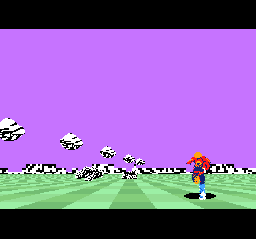

# MonoSH FX2 v001：自機・自弾のカラーOBJ化

2026年10月6日。**自機と自弾・反射弾はSNESのハードウェアスプライト（OBJ）。白黒のOBJ原画をカラー化した。** 自機は赤い服、肌・金色、青い脚、白いハイライト。弾は橙の縁・黄色・白い芯。表示256×180、内部FB256×192・2bppを維持。[今回のROM](../../releases/MonoSHFX2_v001.sfc)、[起動・操作](README.md)。

## 今回の変更と検証

NESの元CHRに残る2bitの色番号を復元し、MSX版 `generate_player_assets.py` と同じ上／下半身のパレット振り分け・死亡poseの配置で17poseをカラー原画へ変換した。上半身の色は参考画像の赤へ合わせた。白黒化したPNGから色を推定する方法は使わず、元CHRの1/3の区別を復元する。自弾は従来の菱形の輪郭を保ったまま橙／黄／白を割り当てた。18枚すべてで元の透明マスクと一致し、姿勢・四辺clip・反転・当たり判定・弾のQ8.8縮小を維持する。[色原画一覧](results/obj_color_20261006/obj_color_atlas.png)。

固定したインデックスPNGとRGB5パレットを同梱したので、通常ビルドはNES/MSXの外部フォルダを必要としない。再取込専用の `tools/import_obj_colors.py --nes-root <NES原本>` にCHRの読み方・pose対応・パレット規則を残した。原本のhashとPNGのhashは [source.json](assets/obj_color/source.json)、調整可能なOBJ配色は [palette.json](assets/obj_color/palette.json)。地面の指定四色と空の紫は前版を保存する。

|カラー版の試験|確認した内容|
|---|---|
|play 360field|通常入力・FX/OBJ合成・FB/VRAM・RAM guard|
|display 720field|三カメラの最終RGB各61,184画素、地面・遠景・OBJの前後|
|objects 360field|85場面、17pose、四反転、16弾サイズ、四辺clip・点滅・最大12 OBJ|
|最終PPUのOBJ|66画面・15,649画素、CGRAMの16色全値、8不透明色の出現|
|全転送＋最大OBJ 360field|毎画像FB12,288bytes＋OAM68bytes、画素・guard一致|

通常版SHA-256は `1134f7fbcc033c178ab8877ad74fbe5a538b478cdac9067612b9aa42cc04c886`。全転送検証版は `48eefbfeca52beed550b3188631be181d49a80efbd1bf039ea645d60bd05f769`。固定上流34ファイルのhashも一致。[今回の検査まとめ](results/obj_color_20261006/summary.json)、[OBJ最終PPU照合](results/obj_color_20261006/objects/objects_ppu.json)。

## DMAと処理時間への影響

OBJは既に4bppだったので、8色へ増やしても静的CHRは有効15,104bytes・118ブロックのまま。起動時に16色32bytesをCGRAM128〜143へ設定し、CHRを起動時のVRAM全転送へ含める。毎画像は従来どおりOAM68bytesだけで、追加のCHR／パレットDMAは不要。

カラー版の全転送試験でも、FB12KiB＋最大12 OBJの最遅完了はPPU20行目。22行目のOBJ準備、23行目の可視開始より前に終わる。FB DMA最大4.83479ms、OAM最大0.071517ms。[カラー版での全転送検証](results/obj_color_20261006/full_transfer_objects/summary.json)。表示192行で同様に成立することは未確認。

ROM差分3,429bytesは起動時のOBJパレット設定・定数、静的OBJ CHR、checksumだけ。GSUコード、CPU実行本体、実行時データは前版と全byte一致した。play/display計4,177計測レコードのうち起動直後10件だけ0.01ms未満の位相差があり、残り4,167件は全項目一致。28field以降の計測は完全一致し、カラー化による毎フレームの処理・転送量の増加はない。

長時間の通常57.05fps／序盤59.35fps、全11試験、C/native比較は [直線パース・OBJ化した配色前版の実測](RESULTS_20261006_GROUND_OBJ.md)。これらを今回のカラーROMで再計測したとは扱わない。地面の指定RGB・列配色の詳細と検査は [直前の地面配色版](RESULTS_20261006_GROUND_PALETTE.md)。依頼原文・判断は [DESIGN_LOG.md](DESIGN_LOG.md)。

自己評価：通常画面で赤い服と青い脚、肌色が読める。弾も黄／橙で白黒の地上物から区別できる。全poseの透明マスク、反転・画面端、実PPUのカラーと前後を検査できた。現在の表示180行・60fps未達・音・実機検証の課題は残る。
