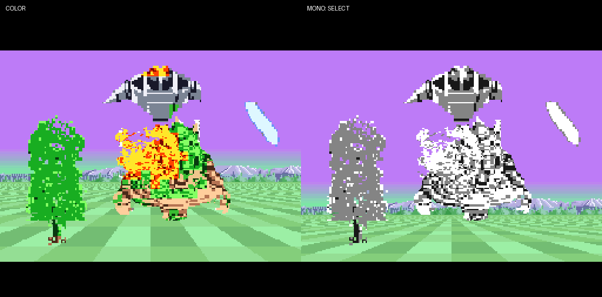

# 2bppの敵・障害物を8×8単位でカラー化

2026年10月8日。透明＋3色の原画と8組のパレットを導入した。CPUがGSUと同じ描画順にBG2ネームテーブルのパレット属性を上書きする。起動時はカラー、SELECTでモノクロ／カラーを切り替える。専用ランチャーはSpaceをSELECTに割り当てた。

対象は2bppの敵・地上物・敵弾・ボス・爆発。自機・自弾のOBJ、地面、空、山・森は従来の配色を保つ。モノクロは同じ3階調のパレットを8組に設定するため、表示する絵や透明部分は切替前後で同じ。切替は押した瞬間だけ受け付け、押し続けても連続反転しない。

**カラー化の描画と切替は動作するが、60fpsには届かない。** 通常操作3,000fieldは平均31.62fps、ボス撃破から次周を含む3,000fieldは平均33.96fps。CPUの属性処理が主な負荷。進行は表示更新に連動して遅くなる。モノクロ切替でも属性計算を続けるので、速度は変更前に戻らない。元の60Hz検証済みROMは [変更前ROM](../../releases/MonoSHFX2_pre_color_20261008.sfc) に保存した。

## 見た目と原画



[録画切出しと量子化後の一覧](assets/bg_color/comparison.png)、[実ゲームのボス](results/bg_color_20261008/boss.png)、[道中](results/bg_color_20261008/enemies.png)を保存した。

指定された `D:\HomeBrew\MonoSH\tmp\スペースハリアー録画１.mp4` のうち、11／41秒の草、10秒の岩、38秒の飛行敵、50秒の木、31.5〜34秒の砲台と弾、62／63秒のボスと炎を使用した。13枚の切出しを既存の原画寸法へ揃え、各8×8セルで3色組と色番号1〜3を選ぶ。色番号0は透明。

紫の空との色差、色相、連結した輪郭で背景や隣の弾を除去した。ボスの顔・胴と炎は、隣の節や地面が混ざらないよう既存素材の透明な外形もマットとして併用する。録画から取り直していない爆発の差分と砲台開閉中の5ポーズは、既存の絵と透明部分を保って火色／金属色を割り当てる。全素材を新たな録画切出しにしたわけではない。

[source.json](assets/bg_color/source.json) に動画hash、時刻、切出し座標、マットの使用、RGB5の8組を記録した。動画そのものは同梱しない。通常ビルドには生成済み原画とパレットを使うため、動画やffmpegは不要。

## CPUと転送

`packet.s`の安定ソート結果を共有し、優先度と奥行きの順に処理する。GSUと同じQ8.8の倍率・左右上下反転・画面端のclipを使い、出力側8×8セルの中心に対応する原画セルからパレットを選ぶ。原画セルが透明だけなら下の色属性を残す。影とタイトルはパレット0として描画順に上書きする。OBJはこの処理から除く。

8×8内では1組しか使えないので、近い物体が同じセルへ入ると奥の画素もその組になる。透明部分の多い輪郭では、中心参照と実際の画素被覆の差も残る。前後の物体ごとの完全な色分離や原作と同じ色数は再現できない。

属性の高位byteだけをCPU側に2面用意する。次画像の計算と表示中画像の転送でバッファを分け、タイル番号・priorityは保つ。CPUの更新先行で色だけ次の画像へ進まないよう、描画パケットと同時にラッチする。前回使った矩形だけを消し、列の参照先を設定したWRAM上の展開ループで属性を書き込む。

属性転送は768bytesを1回にまとめる。前の画像転送後に残る黒帯で裏ネームテーブルへ先送りできれば、その画像のFB転送完了時にBG2の表を切り替える。部分転送の帯域に余裕がある場合は表面へ直接転送する。全12KiBのFBと属性が同じ黒帯に入らない場面では、裏面への属性転送を別fieldへ分けるため、追加の表示待ちが起こる。

SELECTの配色変更も画像の世代へラッチし、CGRAMの32〜63番だけを64bytes転送する。他のBGとOBJのパレットへは書かない。

## 検証

Mesen 2.1.1、NTSC、GSU 100%、追加scanlineなし。実機は未検証。最新の滑らかな拡縮と、山頂の白・地平線・空の修正を統合した同一ROMで確認した。

|試験|field|確認した内容|
|---|---:|---|
|color|360|前後順・反転・clip・1/2pxの縮小・奇数画像の点滅・消去・灰色のタイトル・OBJ除外・SELECTの保持／再押下|
|display|720|三つのカメラ位置でBG1〜4・OBJ・空HDMAを含む最終RGB全画素。山頂の白も独立に要求|
|objects|720|全17ポーズ・4反転・自弾16段階。66画面のOBJ合成70,546画素、最大18 OBJ|
|play|3,000|通常操作・射撃・敵・死亡／復帰・色付き素材とFB転送|
|boss|3,000|ボス・敵弾・撃破演出・次周への進行|
|controls / pause|720 / 360|上下左右・単発・一時停止／再開|
|packed / stress|360 / 360|packed描画の端数と、多数の矩形・全12KiB転送|

色属性はCPU実装とは独立したPythonのソート・座標計算で照合する。178画像の各768セル、合計136,704セルでCPU RAMとVRAMが一致し、全CGRAMも一致。SELECTによるカラー→モノクロ→カラーの遷移を確認した。裏面転送の完了とFB転送の完了が可視scanlineへはみ出さないこと、Cスタックが色用WRAMへ入らないことも検査した。

原画は25枚とも色番号0〜3。ROMは2MiB、内部FBは256×192・2bpp、表示は256×180のまま。カラー用WRAMの実使用は4,508bytes、予約は `$0400..$17ff` の5KiB。CPUコードは `$0000..$fe75` で、次の追加実装には残量確認が必要。

FPSはDMA開始fieldから提示回数を数え、起動時間を除く。同じ黒帯に複数回書いた場合は、最後に画面へ出る1枚だけを数える。各試験の平均・最大CPU/GSU時間、表示間隔、同じ黒帯への追加書込み回数は [profiles.json](results/bg_color_20261008/profiles.json) に保存した。変更前の60.10fpsという測定値は、今回のカラー版へ流用しない。

ROM SHA256: `4ef5a95fec70a4ee3dfcf3b9f39ea38180aa138fd44b7709fed8b21704197025`。

## 再実行

```powershell
python -X utf8 tools/build_game.py
python -X utf8 tools/test_game.py --scenario color --frames 360 --timeout 90
python -X utf8 tools/test_game.py --scenario display --frames 720 --timeout 90
python -X utf8 tools/test_game.py --scenario objects --frames 720 --timeout 90
python -X utf8 tools/test_game.py --scenario play --frames 3000 --timeout 90
python -X utf8 tools/test_game.py --scenario boss --frames 3000 --timeout 90
```

原画を作り直すときだけ `tools/import_recorded_bg_colors.py <動画のパス>` を使う。各試験の全標本は `results/bg_color_20261008/<試験>/samples.zip`、実行スクリプトとtraceは同じ場所のgzipに保存した。標本を `build/game_v001/<試験>/` へ展開すれば、`verify_bg_colors.py` と既存の画素・OBJ・最終合成検査を再実行できる。

## 自己評価と次の改善点

飛行敵の赤い頭、木の緑と幹、弾の紫・青・炎、ボスの緑と肌色を2bppのまま区別できた。モノクロとの比較も同じ素材で行える。8×8の色干渉と小さい砲台の情報量不足は残る。次の優先事項はCPUの座標準備・行処理を短縮して60Hzへ戻すこと。色の近似精度や素材の追加改善は、色世代と転送の整合を保ったうえで行う。
